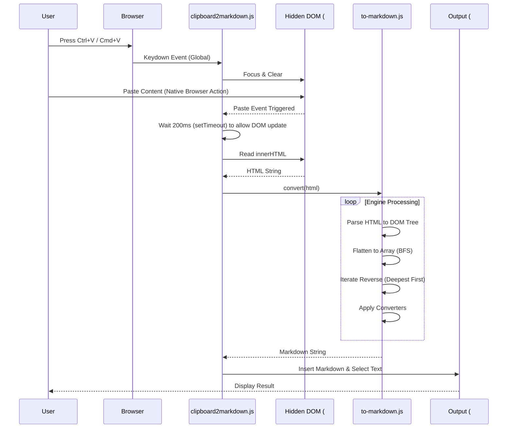

# Architecture

*Mapped: 2026-02-10*

## Project Structure Overview

| File | Purpose |
|------|---------|
| `index.html` | Main application entry point; defines UI and loads scripts |
| `clipboard2markdown.js` | **Controller**: Handles user input, clipboard events, and orchestrates conversion |
| `to-markdown.js` | **Engine**: The core library that parses HTML and converts it to Markdown |
| `bootstrap.css` | Styling framework for the UI |
| `background.svg` | Background asset |

## Tech Stack

- **Runtime:** Browser (Client-side JavaScript)
- **Language:** HTML5, CSS3, JavaScript (ES5+)
- **Key Dependencies:**
  - `to-markdown.js` - The core conversion engine (fork/embedded version of domchristie/to-markdown)
  - `clipboard2markdown.js` - Application logic and custom converter rules (Pandoc-style)

## End-to-End Flow

### Interaction Diagram

## Logic Outline

### 1. Controller Logic (`clipboard2markdown.js`)

This file acts as the glue between the user, the browser, and the conversion engine.

*   **Rule Configuration (`var pandoc = [...]`)**:
    *   Defines an array of converter objects.
    *   Each object has a `filter` (tag name or function) and a `replacement` function.
    *   **Key Customizations**:
        *   *Italics*: Matches `<i>`, `<em>`, and `style="font-style:italic"` (Google Docs support).
        *   *Code Blocks*: detailed logic for `<pre>`, Jira/Confluence `div.code-block`, and Google AI `span.inline-code`.
        *   *Cleanups*: Removes Slack-specific images and normalizes lists.

*   **Helper Functions**:
    *   `escape(str)`: Post-processing to fix smart quotes, dashes, and ensure proper Markdown whitespace/newlines.
    *   `convert(str)`: The main bridge. Calls `toMarkdown(str)` passing in the `pandoc` rules + GFM options, then runs `escape()`.
    *   `insert(myField, myValue)`: Cross-browser utility to insert text into a textarea at the cursor position.

*   **Event Orchestration**:
    *   **Global `keydown`**: Listens for `Ctrl+V` / `Cmd+V`. Instantly clears the `#pastebin` div and focuses it so the browser pastes *there* instead of the body.
    *   **`paste` on `#pastebin`**: Sets a 200ms timeout (critical hack). This delay allows the browser to finish rendering the pasted HTML into the div before the script tries to read `innerHTML`.

### 2. Engine Logic (`to-markdown.js`)

This library handles the heavy lifting of parsing and traversing the HTML.

*   **Main Entry (`toMarkdown(input, options)`)**:
    1.  **Parse**: Converts the input HTML string into a robust DOM structure using `htmlToDom` (wraps `DOMParser` or specific browser implementations).
    2.  **Flatten**: Converts the tree into a linear array using `bfsOrder` (Breadth-First Search).
    3.  **Process**: Iterates through the array in **reverse** (starting from deepest children).

*   **Core Processing Loop (`process(node)`)**:
    *   **Converter Matching**: Checks the node against the list of registered converters (from GFM defaults + user provided `pandoc` rules).
    *   **Content Retrieval**: Calls `getContent(node)` to get the already-processed text of child nodes (since we iterate in reverse, children are already Markdown).
    *   **Replacement**: Executes the matching converter's `replacement` function, passing the child content and the node itself.
    *   **Storage**: Saves the resulting Markdown string into a temporary property `_replacement` on the node itself.

*   **Whitespace Handling**:
    *   `flankingWhitespace(node)`: intricate logic to determine if a node needs leading/trailing spaces based on its neighbors (e.g., `<b>bold</b>` inside text needs handling, but block elements might not).

## Entry Points

Start reading here:

-   `clipboard2markdown.js` - **Read `convert()` first**: This is the high-level function that ties everything together. Then look at the `pandoc` array to see the specific transformation rules.
-   `index.html` - **View Source**: See the `div#pastebin` and how scripts are loaded.
-   `to-markdown.js` - **Read `toMarkdown` function**: Understand the parsing -> flattening -> reverse-iteration pipeline.
