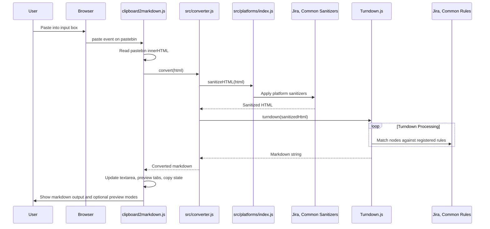

# Architecture

*Mapped: 2026-02-10 | Updated: 2026-02-23*

## Project Structure Overview

| File / Directory | Purpose |
|---|---|
| `index.html` | Main application entry point and UI surface. Contains paste target, output textarea, preview panel tabs, and action controls. |
| `clipboard2markdown.js` | **UI Controller**: Handles DOM events (paste, keydown, button clicks), orchestrates conversion, manages preview modes, and copy actions. Imports logic from `src/platforms`. |
| `vite.config.js` | Vite build configuration. Defines the output directory (`dist/`) and base path for deployment. |
| `package.json` | Project metadata and dependencies (`vite`, `turndown`). Defines `dev`, `build`, and `test` scripts. |
| `src/platforms/` | **Core Logic**: Contains all platform-specific conversion logic. |
| `src/platforms/jira.js` | Exports Jira-specific Turndown `rules` and a `sanitizer` function for pre-processing HTML. |
| `src/platforms/slack.js` | Exports Slack-specific `rules` and `sanitizer` logic for headers, thread separators, replies, and unfurl annotations. |
| `src/platforms/google-chat.js` | Exports Google Chat-specific `rules` and `sanitizer` logic for root-chat/reply annotation extraction. |
| `src/platforms/common.js` | Exports rules and sanitizers that apply to all sources. |
| `src/platforms/index.js` | **Aggregator**: Imports from all other platform files and exports `addAllRules` and `sanitize` helpers. |
| `lib/` | Contains the core `turndown` and `turndown-plugin-gfm` libraries. |
| `dist/` | **Build Output**: Contains the minified and optimized assets for production deployment. This directory is generated by `npm run build`. |
| `tests/` | Contains test fixtures and the automated test runner script. |

## Tech Stack

- **Build Tool:** Vite (provides a dev server with HMR and builds optimized assets for production).
- **Package Manager:** npm
- **Runtime:** Browser (Client-side JavaScript)
- **Language:** HTML5, CSS3, JavaScript (ES Modules)
- **Key Dependencies:**
  - `turndown`: The core HTML-to-Markdown conversion engine.
  - `turndown-plugin-gfm`: Provides GFM extensions (tables, strikethrough).
  - `vitest` / `jsdom` (for testing): Enables automated testing in a Node.js environment.

## End-to-End Flow (Conversion Logic)

## Logic Outline

### 1. UI Controller (`clipboard2markdown.js`)

Acts as the thin glue layer between browser interactions and conversion logic.
*   **Event Orchestration**:
    *   **Global `keydown`**: Listens for `Ctrl+V`/`Cmd+V`, reopens the paste target if collapsed, then focuses it.
    *   **`paste` on `#pastebin`**: Waits 200ms for browser paste rendering, reads `innerHTML`, calls `convert(html)`, updates markdown output, then auto-collapses input.
    *   **Preview mode control**: Toggles between markdown output view and a 3-tab preview panel.
    *   **Copy actions**: Supports copying raw HTML and converted markdown from dedicated action buttons.

*   **UI State Model**:
    *   `previewMode`: Controls whether `#output` or `#preview-panel` is visible.
    *   `inputCollapsed`: Controls whether the paste target is hidden after conversion.
    *   `activePreviewView`: Tracks selected tab (`input`, `raw`, `markdown`).

### 2. Core Conversion (`src/converter.js`)

The pure logic module, decoupled from the DOM.
*   **Initialization**: Configures `TurndownService` with GFM plugin and options.
*   **Rule Loading**: Calls `addAllRules()` to register all platform-specific rules.
*   **Pipeline**:
    1.  `sanitizeHTML(str)`: Parses string to DOM, runs platform sanitizers (e.g., Jira table fix).
    2.  `turndown(dom)`: Converts DOM to Markdown using registered rules.
    3.  `escape(str)`: Post-processes text (smart quotes, whitespace cleanup).

## Annotation Style Contract (Jira, Slack, Google Chat)

To reduce ambiguity for human readers and AI agents, conversational platforms follow a shared annotation contract:

1. **Boundary markers are explicit** (thread or root separators are visible markdown text).
2. **Metadata is italicized** (author, reply lineage, timestamp, edited/external labels).
3. **Raw markdown annotations bypass Turndown escaping** by using `data-*` attributes plus `\u200B` sentinel text where needed.

### Canonical Shapes

| Platform | Separator Shape | Metadata Shape | Mechanism |
|---|---|---|---|
| Jira | `=== Thread {id} ===` | `*[commentId ↩ parentId] Author - Date (edited)*` | `data-jira-thread`, `data-jira-annotation`, `\u200B` sentinel |
| Slack | `*[thread: N replies]*` | `*(↩ reply)* Name [time]` and `*[service unfurl]*` | `data-slack-thread-sep`, `data-slack-reply-header`, `data-slack-unfurl` |
| Google Chat | `=== Root Chat {n} ===` | `*[root n] Author - time*` or `*[reply r to root n] Author - time*` | `data-gchat-thread`, `data-gchat-annotation`, `\u200B` sentinel |

### Extension Rules For Future Platforms

When adding a new conversational source module under `src/platforms/`:
1. Detect message boundaries and inject a visible separator style.
2. Extract author/time/thread semantics into a single italic metadata line before message content.
3. If markdown must remain unescaped, store text in `data-*` attributes and set `textContent = '\u200B'` so Turndown does not prune blank nodes.
4. Register module in `src/platforms/index.js` and add fixture pairs in `tests/fixtures/{platform}/` that prove separator + metadata stability.
5. Prefer shape compatibility with existing Jira/Slack/Google Chat patterns unless a platform constraint makes that impossible.

## Testing Strategy

The project uses a **fixture-based regression testing** approach powered by `vitest` and `jsdom`.

### Mechanism (`npm test`)
1.  **Runner**: `tests/conversion.test.js` recursively scans `tests/fixtures/`.
2.  **Discovery**: Finds all `.html` files (inputs) and matching `.md` files (expected outputs).
3.  **Execution**:
    *   Reads `.html` content.
    *   Passes it to `convert()` (the same function the UI uses).
    *   Asserts the output matches the `.md` content exactly.

### How to Add a Test Case
No code required. Just add data:
1.  **Capture**: Save raw HTML (e.g. from `document.getElementById('pastebin').innerHTML`) to `tests/fixtures/{platform}/{case}.html`.
2.  **Define**: Create `tests/fixtures/{platform}/{case}.md` with the expected Markdown.
3.  **Verify**: Run `npm test`. The runner automatically picks up the new pair.

**Division of Labor:**
- **User maintains fixtures** — creates/updates `.html` and `.md` test pairs based on real-world usage
- **Agents implement code** — modifies `src/platforms/` logic and conversion rules to fix failures

### Debugging Test Failures
When `npm test` fails, the runner writes a detailed report to `./test_md.txt` containing:
- Full expected vs. actual markdown output for each failure
- Error messages with line-by-line diffs
- Easy copy-paste format for troubleshooting and fixture updates

## Entry Points

-   **`package.json`**: Look at the `scripts` to understand how to run the dev server (`dev`), build (`build`), and test (`test`).
-   **`clipboard2markdown.js`**: Read the `paste` event handler to see the main orchestration logic.
-   **`src/platforms/index.js`**: Understand how platform-specific modules are aggregated and applied.
-   **`src/platforms/jira.js`**: See a concrete example of a platform-specific `sanitizer` and `ruleset`.