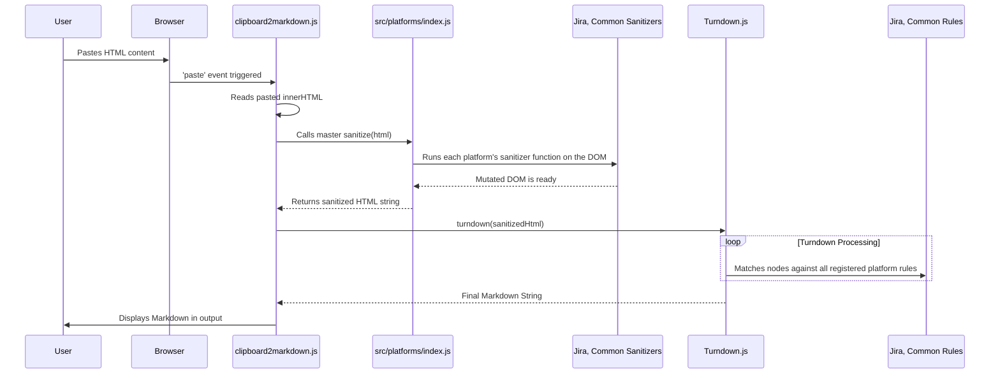

# Architecture

*Mapped: 2026-02-10*

## Project Structure Overview

| File / Directory | Purpose |
|---|---|
| `index.html` | Main application entry point. Loads the main script as an ES Module. |
| `clipboard2markdown.js` | **UI Controller**: Handles DOM events (paste, keydown) and orchestrates the conversion process. Imports logic from `src/platforms`. |
| `vite.config.js` | Vite build configuration. Defines the output directory (`dist/`) and base path for deployment. |
| `package.json` | Project metadata and dependencies (`vite`, `turndown`). Defines `dev`, `build`, and `test` scripts. |
| `src/platforms/` | **Core Logic**: Contains all platform-specific conversion logic. |
| `src/platforms/jira.js` | Exports Jira-specific Turndown `rules` and a `sanitizer` function for pre-processing HTML. |
| `src/platforms/common.js` | Exports rules and sanitizers that apply to all sources. |
| `src/platforms/index.js` | **Aggregator**: Imports from all other platform files and exports `addAllRules` and `sanitize` helpers. |
| `lib/` | Contains the core `turndown` and `turndown-plugin-gfm` libraries. |
| `dist/` | **Build Output**: Contains the minified and optimized assets for production deployment. This directory is generated by `npm run build`. |
| `tests/` | Contains test fixtures and the automated test runner script. |

## Tech Stack

- **Build Tool:** Vite (provides a dev server with HMR and builds optimized assets for production).
- **Package Manager:** npm
- **Runtime:** Browser (Client-side JavaScript)
- **Language:** HTML5, CSS3, JavaScript (ES Modules)
- **Key Dependencies:**
  - `turndown`: The core HTML-to-Markdown conversion engine.
  - `turndown-plugin-gfm`: Provides GFM extensions (tables, strikethrough).
  - `vitest` / `jsdom` (for testing): Enables automated testing in a Node.js environment.

## End-to-End Flow (Conversion Logic)

## Logic Outline

### 1. UI Controller (`clipboard2markdown.js`)

Acts as the thin glue layer between the browser and the conversion logic.
*   **Event Orchestration**:
    *   **Global `keydown`**: Listens for `Ctrl+V`. Clears/focuses `#pastebin` div.
    *   **`paste` on `#pastebin`**: Sets a 200ms timeout to allow browser rendering, then reads `innerHTML`.
    *   **Handoff**: Calls `convert(html)` from `src/converter.js` and displays result.

### 2. Core Conversion (`src/converter.js`)

The pure logic module, decoupled from the DOM.
*   **Initialization**: Configures `TurndownService` with GFM plugin and options.
*   **Rule Loading**: Calls `addAllRules()` to register all platform-specific rules.
*   **Pipeline**:
    1.  `sanitizeHTML(str)`: Parses string to DOM, runs platform sanitizers (e.g., Jira table fix).
    2.  `turndown(dom)`: Converts DOM to Markdown using registered rules.
    3.  `escape(str)`: Post-processes text (smart quotes, whitespace cleanup).

## Testing Strategy

The project uses a **fixture-based regression testing** approach powered by `vitest` and `jsdom`.

### Mechanism (`npm test`)
1.  **Runner**: `tests/conversion.test.js` recursively scans `tests/fixtures/`.
2.  **Discovery**: Finds all `.html` files (inputs) and matching `.md` files (expected outputs).
3.  **Execution**:
    *   Reads `.html` content.
    *   Passes it to `convert()` (the same function the UI uses).
    *   Asserts the output matches the `.md` content exactly.

### How to Add a Test Case
No code required. Just add data:
1.  **Capture**: Save raw HTML (e.g. from `document.getElementById('pastebin').innerHTML`) to `tests/fixtures/{platform}/{case}.html`.
2.  **Define**: Create `tests/fixtures/{platform}/{case}.md` with the expected Markdown.
3.  **Verify**: Run `npm test`. The runner automatically picks up the new pair.

## Entry Points

-   **`package.json`**: Look at the `scripts` to understand how to run the dev server (`dev`), build (`build`), and test (`test`).
-   **`clipboard2markdown.js`**: Read the `paste` event handler to see the main orchestration logic.
-   **`src/platforms/index.js`**: Understand how platform-specific modules are aggregated and applied.
-   **`src/platforms/jira.js`**: See a concrete example of a platform-specific `sanitizer` and `ruleset`.
