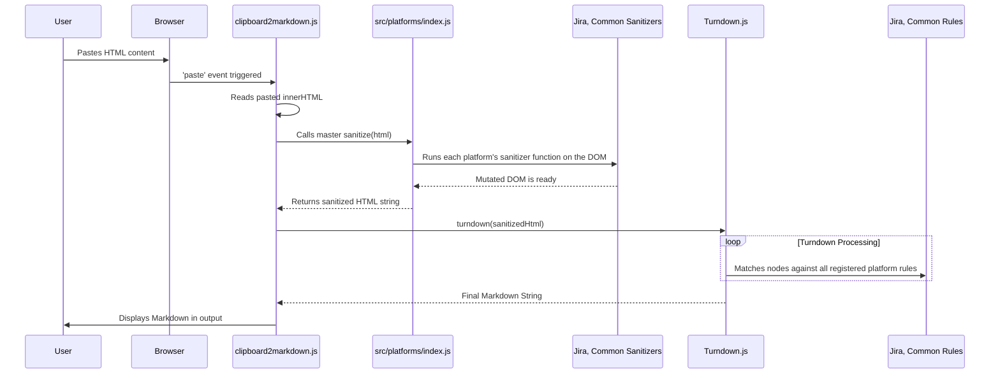

# Architecture

*Mapped: 2026-02-10*

## Project Structure Overview

| File / Directory | Purpose |
|---|---|
| `index.html` | Main application entry point. Loads the main script as an ES Module. |
| `clipboard2markdown.js` | **UI Controller**: Handles DOM events (paste, keydown) and orchestrates the conversion process. Imports logic from `src/platforms`. |
| `vite.config.js` | Vite build configuration. Defines the output directory (`dist/`) and base path for deployment. |
| `package.json` | Project metadata and dependencies (`vite`, `turndown`). Defines `dev`, `build`, and `test` scripts. |
| `src/platforms/` | **Core Logic**: Contains all platform-specific conversion logic. |
| `src/platforms/jira.js` | Exports Jira-specific Turndown `rules` and a `sanitizer` function for pre-processing HTML. |
| `src/platforms/common.js` | Exports rules and sanitizers that apply to all sources. |
| `src/platforms/index.js` | **Aggregator**: Imports from all other platform files and exports `addAllRules` and `sanitize` helpers. |
| `lib/` | Contains the core `turndown` and `turndown-plugin-gfm` libraries. |
| `dist/` | **Build Output**: Contains the minified and optimized assets for production deployment. This directory is generated by `npm run build`. |
| `tests/` | Contains test fixtures and the automated test runner script. |

## Tech Stack

- **Build Tool:** Vite (provides a dev server with HMR and builds optimized assets for production).
- **Package Manager:** npm
- **Runtime:** Browser (Client-side JavaScript)
- **Language:** HTML5, CSS3, JavaScript (ES Modules)
- **Key Dependencies:**
  - `turndown`: The core HTML-to-Markdown conversion engine.
  - `turndown-plugin-gfm`: Provides GFM extensions (tables, strikethrough).
  - `vitest` / `jsdom` (for testing): Enables automated testing in a Node.js environment.

## End-to-End Flow (Conversion Logic)

## Logic Outline

### 1. Controller Logic (`clipboard2markdown.js`)

This file acts as the glue between the user, the browser, and the conversion engine.

*   **Rule Configuration (`var pandoc = [...]`)**:
    *   Defines an array of converter objects.
    *   Each object has a `filter` (tag name or function) and a `replacement` function.
    *   **Key Customizations**:
        *   *Italics*: Matches `<i>`, `<em>`, and `style="font-style:italic"` (Google Docs support).
        *   *Code Blocks*: detailed logic for `<pre>`, Jira/Confluence `div.code-block`, and Google AI `span.inline-code`.
        *   *Cleanups*: Removes Slack-specific images and normalizes lists.

*   **Helper Functions**:
    *   `escape(str)`: Post-processing to fix smart quotes, dashes, and ensure proper Markdown whitespace/newlines.
    *   `convert(str)`: The main bridge. Calls `toMarkdown(str)` passing in the `pandoc` rules + GFM options, then runs `escape()`.
    *   `insert(myField, myValue)`: Cross-browser utility to insert text into a textarea at the cursor position.

*   **Event Orchestration**:
    *   **Global `keydown`**: Listens for `Ctrl+V` / `Cmd+V`. Instantly clears the `#pastebin` div and focuses it so the browser pastes *there* instead of the body.
    *   **`paste` on `#pastebin`**: Sets a 200ms timeout (critical hack). This delay allows the browser to finish rendering the pasted HTML into the div before the script tries to read `innerHTML`.

### 2. Engine Logic (`to-markdown.js`)

This library handles the heavy lifting of parsing and traversing the HTML.

*   **Main Entry (`toMarkdown(input, options)`)**:
    1.  **Parse**: Converts the input HTML string into a robust DOM structure using `htmlToDom` (wraps `DOMParser` or specific browser implementations).
    2.  **Flatten**: Converts the tree into a linear array using `bfsOrder` (Breadth-First Search).
    3.  **Process**: Iterates through the array in **reverse** (starting from deepest children).

*   **Core Processing Loop (`process(node)`)**:
    *   **Converter Matching**: Checks the node against the list of registered converters (from GFM defaults + user provided `pandoc` rules).
    *   **Content Retrieval**: Calls `getContent(node)` to get the already-processed text of child nodes (since we iterate in reverse, children are already Markdown).
    *   **Replacement**: Executes the matching converter's `replacement` function, passing the child content and the node itself.
    *   **Storage**: Saves the resulting Markdown string into a temporary property `_replacement` on the node itself.

*   **Whitespace Handling**:
    *   `flankingWhitespace(node)`: intricate logic to determine if a node needs leading/trailing spaces based on its neighbors (e.g., `<b>bold</b>` inside text needs handling, but block elements might not).

## Entry Points

-   **`package.json`**: Look at the `scripts` to understand how to run the dev server (`dev`), build (`build`), and test (`test`).
-   **`clipboard2markdown.js`**: Read the `paste` event handler to see the main orchestration logic.
-   **`src/platforms/index.js`**: Understand how platform-specific modules are aggregated and applied.
-   **`src/platforms/jira.js`**: See a concrete example of a platform-specific `sanitizer` and `ruleset`.
