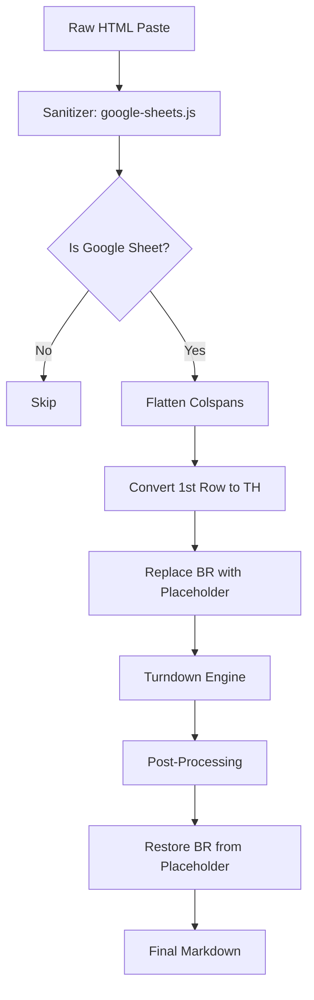
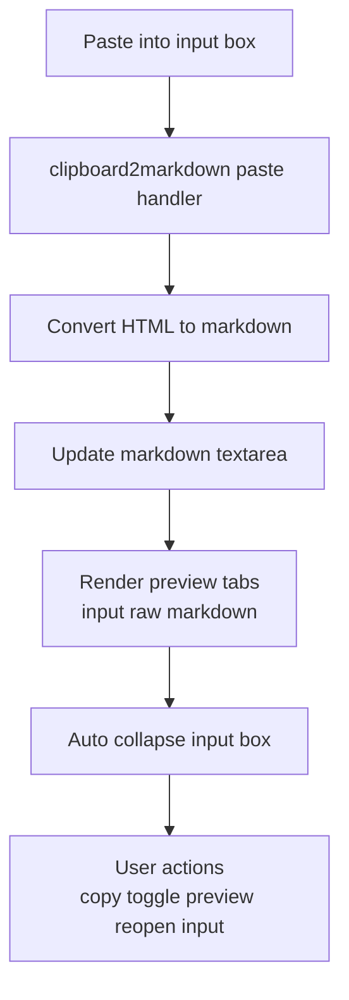
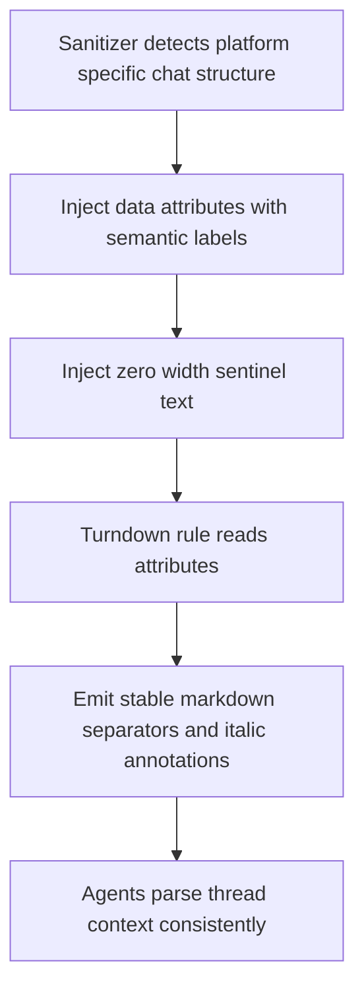
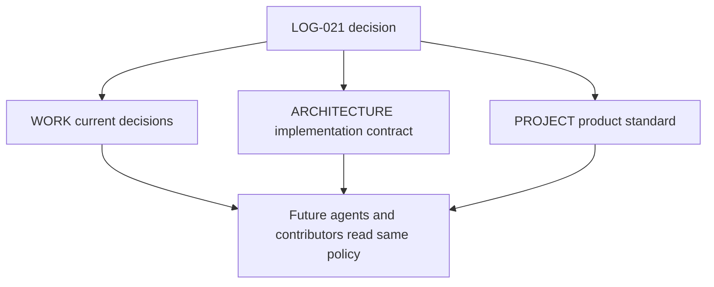
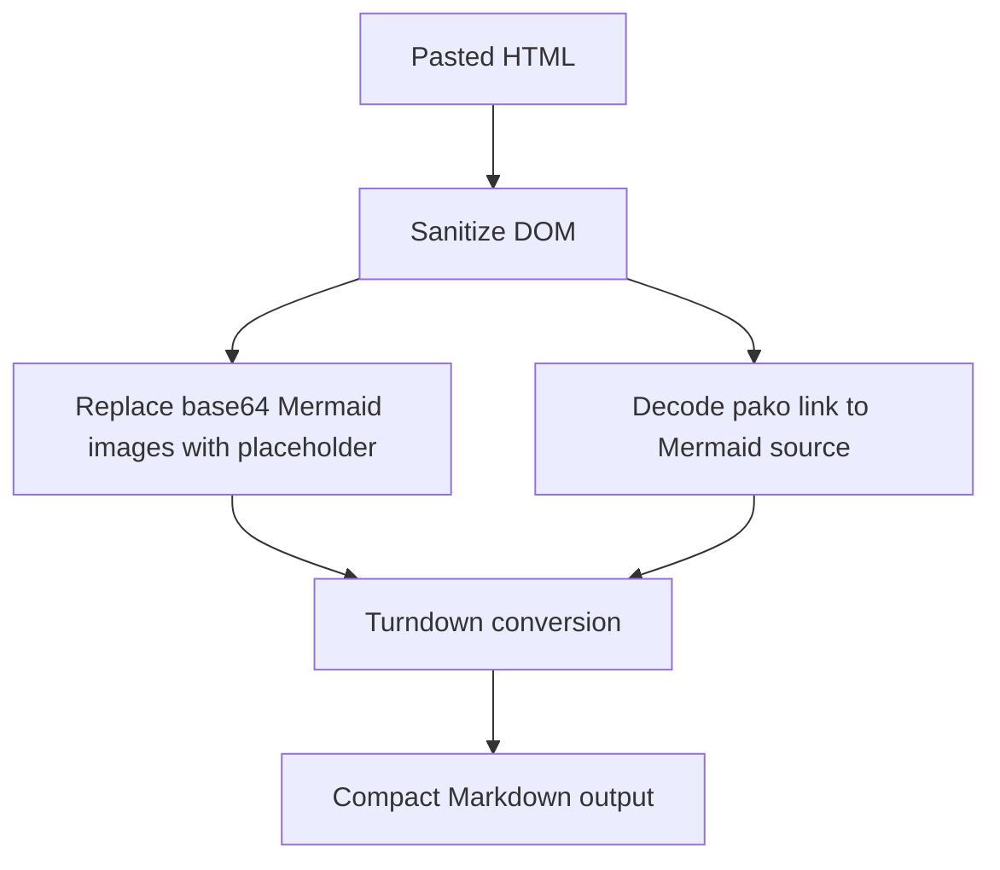
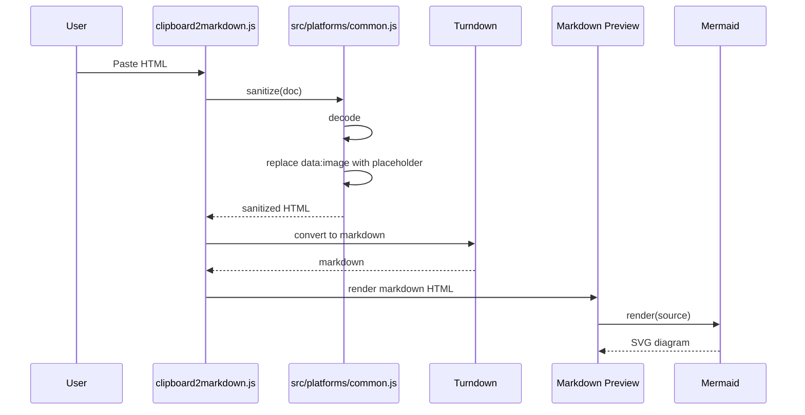
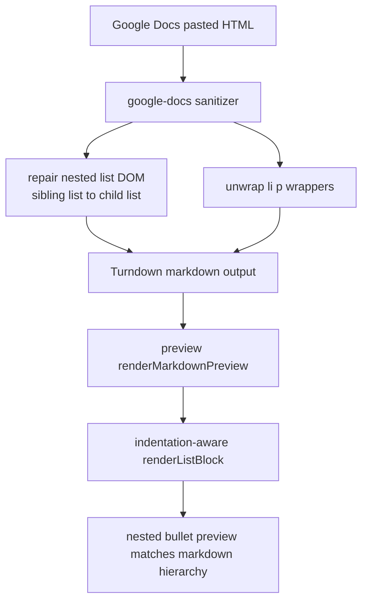

# GSD-Lite Work Log

---

## 1. Current Understanding (Read First)

<current_mode>
discuss
</current_mode>

<active_task>
TASK-014 executed end-to-end — Google Docs list hierarchy issue fixed across sanitizer and markdown preview renderer (nested bullets now retain depth).
</active_task>

<parked_tasks>
TASK-003: Add debug mode toggle with XML bundle export
TASK-004: Create LLM sanitization prompt for test fixtures
</parked_tasks>

<vision>
A client-side webapp that converts copied web content (HTML) into clean Markdown. It is powered by a Vite build system for reliable development and deployment. The conversion logic is modular, allowing for platform-specific rules (Jira, Confluence, etc.) and is covered by an automated regression test suite.
</vision>

<decisions>
DECISION-001: Migrate to Turndown.js — maintained successor to to-markdown.js, GFM table support, same author
DECISION-002: Debug bundle format is XML-tagged — agent-native, human-readable, no escaping issues
DECISION-003: Agent-as-oracle for testing — CI can't run paste events, LLM evaluates conversion quality
DECISION-004: Vendor Turndown locally — reliability over CDN, works offline, consistent with project structure
DECISION-005: Port all existing rules — no trimming, maintain feature parity during migration
DECISION-006: Pre-process HTML before Turndown — sanitize platform quirks rather than fighting the library
DECISION-007: Use Vite for the build system — solves browser caching and provides a modern dev environment.
DECISION-008: Adopt a modular `platforms/` architecture — isolates platform-specific logic for maintainability.
DECISION-009: Jira comment thread annotations — visible italic headers `*[ID ↩ parentID] Author - Date*` + `=== Thread X ===` separators. Blockquotes rejected (break code blocks/tables inside them).
DECISION-010: `data-attr + \u200B sentinel` pattern — reliable way to inject raw markdown through Turndown without escaping. Set `data-foo="raw text"` + `textContent='\u200B'` on element; custom rule reads attribute, ignores content.
DECISION-011: UX trust mode uses three preview tabs — rendered input HTML, raw HTML source, and rendered markdown preview — while keeping markdown textarea as canonical copy output.
DECISION-012: App opens directly in main conversion view with visible paste target; input box auto-collapses after paste and can be manually reopened.
DECISION-013: Cross-platform annotation contract — preserve conversational structure with visible separators + italic metadata annotations, using `data-attr + \u200B` to bypass Turndown escaping and keep output agent-readable.
DECISION-014: Strip embedded base64 `data:image/...` payloads at sanitize time and replace with lightweight placeholders to protect agent context size.
DECISION-015: Markdown preview renders Mermaid via client-side `mermaid.render(...)` with source normalization (`decodeHtmlEntities`) and explicit inline error fallback.
</decisions>

<blockers>
None
</blockers>

<next_action>
User will add fixtures for the Google Docs nested-list regression and then decide whether to run a full fixture sweep for list-heavy docs.
</next_action>

---

## 2. Key Events Index (Project Foundation)

### Architecture Decisions
- LOG-001: Turndown Migration — Replaced to-markdown.js with Turndown.js + GFM plugin
- LOG-002: Project Reorganization — lib/, assets/, script/ folders for cleaner structure
- LOG-019: Jira comment thread annotation pattern — `=== Thread X ===` + italic metadata headers.
- LOG-020: Trust UX pattern — preview tabs + collapsible input to reduce ambiguity.
- LOG-021: Cross-platform annotation contract — unified structure semantics for Jira, Slack, and Google Chat, with extension rules for future platforms.

---

## 3. Atomic Session Log (Chronological)

### [LOG-001] - [PLAN] - Turndown migration plan created - Task: TASK-002
**Timestamp:** 2026-02-10
**Details:**
- Analyzed current `clipboard2markdown.js` — found 10 custom rules in `pandoc` array
- Confirmed Turndown API compatibility: `filter` + `replacement` signature identical
- GFM plugin provides tables, strikethrough, task lists out of box
- Decision: Vendor locally (not CDN) for reliability + offline support
- Decision: Port all rules, no trimming

### [LOG-002] - [EXEC] - Project reorganization - Task: TASK-002
**Timestamp:** 2026-02-10
**Details:**
- Created `lib/` — vendored `turndown.js` + `turndown-plugin-gfm.js`
- Created `assets/` — moved `bootstrap.css`, `background.svg`, `background-dark.svg`
- Created `script/` — moved `download_turndown.py`
- `to-markdown.js` left in root (pending deletion after migration verified)

### [LOG-003] - [EXEC] - Turndown migration complete - Task: TASK-002
**Timestamp:** 2026-02-10
**Details:**
- Updated `index.html`:
  - Script refs: `lib/turndown.js`, `lib/turndown-plugin-gfm.js`
  - Asset refs: `assets/bootstrap.css`, `assets/background*.svg`
  - Attribution text updated to link Turndown
- Rewrote `clipboard2markdown.js`:
  - TurndownService with options: `headingStyle: 'atx'`, `codeBlockStyle: 'fenced'`, etc.
  - `.use(turndownPluginGfm.gfm)` for tables/strikethrough/tasklists
  - Ported all 10 custom rules via `addRule()`
  - `escape()` post-processor preserved (smart punctuation cleanup)
- Initial test: basic cases work ✓
- Blocker found: Jira tables still broken

### [LOG-004] - [FIX] - Jira table conversion fixed via HTML pre-processing - Task: TASK-005
**Timestamp:** 2026-02-10
**Details:**
- **Root cause:** Jira wraps table cell content in `<p data-renderer-start-pos="...">` tags
- Turndown GFM plugin expects simple `<td>text</td>`, not nested `<p>` elements
- **Fix approach:** Pre-process HTML before Turndown (sanitize, don't fight the library)
- Added `sanitizeHTML()` function to `clipboard2markdown.js`:
  - Strips `<p>` tags inside `<td>`/`<th>`, preserving content
  - Removes empty `<span>` elements that interfere with parsing
- Updated `convert()` to call `sanitizeHTML(str)` before `turndown()`
- **Result:** Tables now convert correctly to markdown pipe format ✓
- **Remaining issue:** SQL code blocks lose line breaks (all on one line)
  - Jira's code block HTML structure needs investigation
  - Likely similar pre-processing fix needed

### [LOG-005] - [FEAT] - Google Sheets support implemented - Task: TASK-006
**Timestamp:** 2026-02-10
**Summary:** Implemented `google-sheets.js` platform module with sanitizer logic to handle merged cells (`colspan`) and line breaks (`<br>`) in tables, enabling clean Markdown table generation from Google Sheets copy-paste.

**Context & Problem:**
Copying from Google Sheets produces complex HTML that breaks standard Markdown converters:
1.  **Merged Cells:** Sheets uses `colspan="N"` to span columns visually. Turndown GFM plugin expects 1:1 `<td>` per column mapping and outputs raw HTML when it encounters spans.
2.  **Missing Headers:** Sheets uses `<td>` for the first row, but GFM requires `<th>` to recognize a table header.
3.  **Line Breaks:** Cells with multiple lines use `<br>`, but Markdown tables must be single-line per row.

**Solution Architecture:**
We implemented a dedicated sanitizer in `src/platforms/google-sheets.js` that runs *before* Turndown (following the pattern established in [LOG-004] for Jira).



**Key Implementation Details:**

1.  **Colspan Flattening (The "Visual Match" Strategy):**
    We flatten merged cells to match the visual grid. A cell spanning 2 columns becomes 1 cell, and its "ghost" neighbor (an empty placeholder `<td>`) is removed.
    *   **Logic:** Iterate `tr`, find `colspan="N"`, remove attribute. Then remove the next N-1 empty `<td>` elements.
    *   **Result:** A 4-column visual table becomes a 4-column HTML table structure that GFM understands.

2.  **Header Row Promotion:**
    Explicitly convert the first `<tr>`'s children from `<td>` to `<th>`.
    *   **Reasoning:** Turndown's GFM table rule strict check: `if (node.nodeName === 'TABLE' && hasThead(node))` — without `<th>`, it treats it as a layout table, not data.

3.  **Line Break Preservation (The Placeholder Pattern):**
    *   **Problem:** `<br>` inside a table cell breaks the single-line rule of Markdown tables.
    *   **Fix:** Sanitize `<br>` → `{{TABLE_BR}}` string literal.
    *   **Post-Process:** `src/converter.js` regex replaces `{{TABLE_BR}}` → `<br>` *after* Markdown generation.
    *   **Code:**
        ```javascript
        // src/platforms/google-sheets.js
        table.querySelectorAll('td br, th br').forEach(function (br) {
          br.replaceWith('{{TABLE_BR}}');
        });
        ```
    *   **Reference:** Same pattern used in Confluence logic (see `src/platforms/confluence.js`).

**Dependencies:**
-   **Upstream:** [LOG-004] (Sanitizer pattern established)
-   **Modules:** `src/platforms/google-sheets.js`, `src/platforms/index.js` (registration)

**Verification:**
-   Input: `tests/fixtures/google-sheets/simple_table.html` (4x4 table with colspans)
-   Output: Clean Markdown pipe table with `<br>` preserved in cells.
-   Status: **Verified & Merged**.

---
**Timestamp:** 2026-01-22 14:10
**Details:**
- SUBTASK-001: Base card component with props interface
- SUBTASK-002: Engagement metrics display (likes, comments, shares)
- SUBTASK-003: Layout grid with responsive breakpoints
- Risk: Responsive behavior may need user verification on mobile

### [LOG-005] - [SETUP] - Vite build system implemented - Task: N/A
**Timestamp:** 2026-02-10
**Details:**
- **Problem:** Browser caching was preventing JavaScript changes from loading, making debugging difficult.
- **Solution:** Introduced a `vite` build step to enable a modern development workflow.
- **Actions Taken:**
  - `npm init` and installed `vite`, `turndown`, and `turndown-plugin-gfm`.
  - Created `vite.config.js` with `base` path for GitHub Pages deployment.
  - Updated `package.json` with `dev`, `build`, and `preview` scripts.
  - Refactored `clipboard2markdown.js` and `index.html` to use ES Module imports instead of global scripts.
- **Outcome:** Caching issues are resolved. `npm run dev` provides a hot-reloading server for rapid testing. `npm run build` creates a production-ready `dist/` directory.

### [LOG-006] - [FIX] - Jira code block newlines and indentation preserved - Task: TASK-006
**Timestamp:** 2026-02-10
**Details:**
- **Root Cause:** A combination of HTML parser whitespace collapsing and Turndown's text extraction logic was dropping newlines and leading spaces.
- **Solution:** Implemented a robust, two-part pre-processing (sanitizer) and processing (rule) pipeline.
  - **Sanitizer (`sanitizeHTML`):**
    1. Iterates through Jira's line-based `<span>` elements.
    2. Replaces leading spaces with non-breaking space entities (`&nbsp;`) to prevent the HTML parser from collapsing them.
    3. Joins the processed lines with `<br>` tags to ensure the line breaks survive the DOM parsing step.
    4. Injects this new HTML back into the `<code>` element's `innerHTML`.
  - **Turndown Rule (`confluenceCodeBlock`):**
    1. Clones the `<code>` node to avoid altering the DOM.
    2. Replaces all `<br>` elements with `\n` characters.
    3. Replaces all `&nbsp;` characters (`\u00A0`) back to regular spaces.
    4. Extracts the cleaned `textContent` for the final markdown output.
- **Status:** The fix is verified and working correctly. **TASK-006 is complete.**

### [LOG-007] - [PLAN] - Refactor and implement automated testing - Task: TASK-007, TASK-008
**Timestamp:** 2026-02-10
**Details:**
- **Goal:** Improve maintainability and prevent regressions.
- **New Tasks Created:**
  - **TASK-007:** Refactor platform-specific logic into a modular `src/platforms/` directory.
  - **TASK-008:** Implement an automated test runner to verify fixtures.
- **Refactor Plan (TASK-007):**
  1. Move all generic rules (sup, sub, etc.) and sanitizers from `clipboard2markdown.js` to `src/platforms/common.js`.
  2. Update `src/platforms/index.js` to import and export all platform modules.
  3. Refactor `clipboard2markdown.js` into a slim orchestrator that imports `addAllRules` and `sanitize` from `src/platforms/index.js` and focuses only on DOM event handling.
- **Automated Test Plan (TASK-008):**
  1. Install `vitest` and `jsdom` as dev dependencies.
  2. Create a test file (e.g., `tests/conversion.test.js`).
  3. The test script will read all `.html` and `.md` file pairs from `tests/fixtures/`.
  4. For each pair, it will run the `convert` function on the HTML and assert that the output exactly matches the expected markdown.
  5. Update `package.json` to run tests via `npm test`.
- **Decision:** This modular structure makes it easy to add new platforms (Confluence, Notion) and test cases in the future.

### [LOG-008] - [EXEC] - Modular Refactor and Test Setup - Task: TASK-007, TASK-008
**Timestamp:** 2026-02-10
**Details:**
- **Refactor (TASK-007):**
  - Created `src/platforms/common.js` for generic rules.
  - Created `src/platforms/slack.js` for Slack-specific rules.
  - Updated `src/platforms/index.js` to aggregate all platforms.
  - Extracted core conversion logic to `src/converter.js` (imports `TurndownService` and platform rules).
  - Simplified `clipboard2markdown.js` to be a pure UI controller importing `convert()` from `src/converter.js`.
- **Test Infrastructure (TASK-008):**
  - Updated `vite.config.js` to include `test` configuration (jsdom environment).
  - Updated `package.json` to add `vitest` script.
  - Created `tests/conversion.test.js` which recursively finds fixtures and verifies conversion.
- **Next Steps:** User needs to run `npm install -D vitest jsdom` and `npm test` to verify.

### [LOG-009] - [FIX] - Test Failure Resolution - Task: TASK-008
**Timestamp:** 2026-02-10
**Details:**
- **Issue:** Test failed because Jira HTML contained `<button>Open image...</button>` text which polluted the Markdown output.
- **Fix:** Added a generic `removeButtons` rule to `src/platforms/common.js` to strip all button elements.
- **Status:** Tests passed after fix.
- **Pivot:** Switching to discuss mode to explain testing workflow to user.

### [LOG-010] - [INFO] - Testing Strategy Documented - Task: TASK-008
**Timestamp:** 2026-02-10
**Details:**
- **Action:** Updated `ARCHITECTURE.md` to reflect the new modular structure and the testing strategy.
- **Key Discovery:** The fixture-based testing model allows adding test cases without writing code (just files).
- **Documented Workflow:**
  1. Capture HTML from `pastebin`.
  2. Save as `.html` fixture.
  3. Create matching `.md` expectation.
  4. Run `npm test`.

### [LOG-011] - [FIX] - Disabled underscore escaping in Turndown - Task: TASK-008
**Timestamp:** 2026-02-10
**Details:**
- **Issue:** Turndown escapes ALL underscores by default (e.g., `join_payment_provider` → `join\_payment\_provider`). This is overly aggressive — underscores mid-word don't trigger emphasis in CommonMark.
- **Root Cause:** Turndown's default `escapes` array includes `[/_/g, '\\_']`.
- **Fix:** Overrode `turndownService.escape` in `src/converter.js` to unescape underscores after default escaping:
  ```javascript
  var originalEscape = turndownService.escape.bind(turndownService);
  turndownService.escape = function (string) {
    return originalEscape(string).replace(/\\_/g, '_');
  };
  ```
- **Fixture Updated:** `tests/fixtures/jira/jira_comments_with_table.md` corrected to expect unescaped underscores.
- **Reference:** https://github.com/mixmark-io/turndown/issues/233

### [LOG-012] - [FEATURE] - Added "Copy Raw HTML" button for fixture collection - Task: TASK-008
**Timestamp:** 2026-02-10
**Details:**
- **Problem:** Platforms like Slack don't expose clipboard HTML in dev tools, making fixture collection difficult.
- **Solution:** Added a "📋 Copy Raw HTML" button that appears after paste.
- **Implementation:**
  - `index.html`: Added button + status span in wrapper section.
  - `clipboard2markdown.js`: Store `lastPastedHtml` on paste, button copies it to clipboard via `navigator.clipboard.writeText()`.
- **Workflow:** Paste → Click button → Save HTML to `tests/fixtures/{platform}/{case}.html`.

### [LOG-013] - [SETUP] - CI/CD pipeline implemented - Task: N/A
**Timestamp:** 2026-02-10
**Details:**
- **Goal:** Automate testing on PRs, gate deployments behind passing tests.
- **Architecture:** Two separate workflows for clean separation of concerns.
- **Files Created/Modified:**
  - `.github/workflows/ci.yml` (NEW): Runs `npm run test` on pull requests to `master`.
  - `.github/workflows/static.yml` (MODIFIED): Added `test` job before `deploy`; deploy now `needs: test`.
- **Behavior:**
  - PRs to master → CI runs tests → blocks merge if fail
  - Push to master → Tests run → Deploy only if tests pass
  - Direct pushes to master still gated by test job in `static.yml`
- **Node version:** 20 (LTS), with npm caching enabled for faster runs.

### [LOG-014] - [FIX] - Slack conversion bugs fixed - Task: N/A
**Timestamp:** 2026-02-10
**Details:**
- **Problem:** Slack test fixture failing — two converter bugs identified:
  1. Ordered list items rendered on single line (`1. ...2. ...3. ...`)
  2. Code blocks not fenced — Slack uses `<pre><div>` not `<pre><code>`
- **Root Causes:**
  - `fencedCodeBlock` rule required `PRE > CODE` structure; Slack's `<pre><div>` didn't match
  - `listItem` rule missing trailing newline between items
- **Fixes in `src/platforms/common.js`:**
  1. `fencedCodeBlock`: Changed filter to match any `<pre>` element (removed `<code>` child requirement)
  2. `listItem`: Added trailing `\n` to replacement output
- **Result:** `npm test` passes, Slack fixtures now convert correctly

### [LOG-015] - [FEATURE] - Confluence table and list support - Task: TASK-009
**Timestamp:** 2026-02-10
**Details:**
- **Feature:** Added full support for complex Confluence content including nested tables, expand containers, and smart links.
- **Challenges Solved:**
  1. **Smart Links:** Confluence renders links as `<span data-inline-card>` with no `<a>` tag. Added sanitizer to convert them to proper anchors.
  2. **Emoji Images:** Converted `` to unicode characters.
  3. **Table Headers:** Cleaned up complex nested `<div>` and sorting icons in `<th>` cells.
  4. **Lists in Tables:** Markdown tables don't support lists. Implemented flattening logic to convert `<ul>/<li>` inside cells to inline text with `<br>` and `•` bullets.
  5. **Mixed Content:** Handled cells containing both paragraphs and lists by inserting correct `<br>` separators.
  6. **Empty Cells:** Added non-breaking spaces to empty cells to maintain table structure.
- **Testing:** Added robust fixtures (`bullet.html`, `nested_table.html`, `table.html`) covering edge cases.
- **Bug Fix:** Fixed issue where pasting new content appended to old content instead of replacing it.

### [LOG-016] - [REFINE] - Test Fixture Alignment - Task: TASK-009
**Timestamp:** 2026-02-10
**Details:**
- **Context:** Updated test fixtures to match improved converter output.
- **Decision:** Accepted that `<p>Text</p><ul><li>List</li></ul>` should render as `Text<br>- List` in table cells (with explicit break) rather than running together.
- **Action:** Updated `table.md` fixture to include `<br>` between text and lists, aligning the test expectation with the semantically correct converter output.
- **Result:** All tests passing.

### [LOG-017] - [FIX] - Google Sheets complex table support - Task: TASK-007
**Timestamp:** 2026-02-11
**Summary:** Implemented robust handling for complex Google Sheets tables including merged cells (rowspan/colspan), missing ghost cells, and pipe characters in links.

**The Challenge:**
Google Sheets HTML is notoriously difficult:
1.  **Rowspan Ghosts:** A cell with `rowspan="N"` causes the next N-1 rows to physically miss that `<td>`. This breaks Markdown table generators which expect a rectangular grid.
2.  **Colspan Logic:** A cell with `colspan="N"` is visually 1 column but physically covers N columns in the grid logic.
3.  **Broken Links:** Links containing `|` characters (e.g. "Operations | Google Cloud") break Markdown tables by acting as column separators.
4.  **Nested Breaks:** `<br>` tags inside links (`<a href>text<br></a>`) were causing breaks inside the link text.

**The Solution (Pattern: Grid Reconstruction):**
Instead of trying to patch the DOM in-place, we now:
1.  **Reconstruct the Visual Grid:** Build a 2D array representing the table, filling in "ghost" cells created by rowspans with placeholders.
2.  **Logical Column Counting:** Determine column count from the header row (logical cells) rather than the physical colgroup (which counts merged columns separately).
3.  **Sanitize Links:** 
    *   Move `<br>` out of `<a>` tags.
    *   Replace `|` in link text with `{{PIPE}}` placeholder (restored as `\|` post-processing).

**Key Algorithm:**
```javascript
// 1. Sanitize links (move <br>, placeholder pipes)
// 2. Build 2D grid from rows
// 3. For each cell:
//    - If blocked by rowspan from above -> inject placeholder
//    - If new cell -> use content, track its rowspan
// 4. Rebuild DOM from grid
```

**Outcome:**
*   Complex tables with mixed rowspans/colspans now render perfectly.
*   Links with pipes work correctly inside tables.
*   `tmp.html` case fully resolved.

### [LOG-018] - [FIX] - Unescaped dashes in table cells - Task: TASK-007
**Timestamp:** 2026-02-11
**Summary:** Fixed regression where dashes at the start of lines inside table cells were being escaped (e.g., `\- item`).

**Problem:**
Turndown's default escape function is aggressive: it escapes any `-` at the start of a line because it *could* be a list marker. However, inside a Markdown table cell, block-level lists are not supported, so a literal `-` is valid and preferred for bullet-like formatting. Users relying on manual indentation + dashes (e.g., `<br> - sub-item`) saw inconsistent behavior depending on spacing.

**Solution:**
Updated the `turndownService.escape` override in `src/converter.js` to unescape dashes:
```javascript
return originalEscape(string)
  .replace(/\\_/g, '_')
  .replace(/\\-/g, '-'); // New: unescape dashes
```

**Outcome:**
*   `\- Good ol'` -> `- Good ol'`
*   Preserves indentation for manual nested lists (e.g., `  - item`).
*   Verified with `tmp.html` case and existing regression tests.

### [LOG-019] - [FIX+FEAT] - Jira comment bugs fixed + thread annotation implemented - Task: N/A
**Timestamp:** 2026-02-23
**Depends On:** LOG-004 (Jira table pre-processing pattern), LOG-011 (Turndown escape override pattern)

---

#### Bug Fixes (4 issues in Jira comment rendering)

**Bug 1 — OL `start` attribute ignored** (`src/platforms/common.js`)
Jira renders each numbered section as a separate `<ol start="N">` with a single `<li>`. The `listItem` rule used `Array.indexOf` which always returned `1`. Fixed by reading `parent.getAttribute('start')` and computing `start + index - 1`.

**Bug 2 — Table with `<colgroup>` not converted** (`src/platforms/jira.js` sanitizer)
`turndown-plugin-gfm`'s `isFirstTbody()` checks `previousSibling` — a `<colgroup>` before `<tbody>` caused it to return `false`, so the table fell back to raw HTML. Fixed by removing `table colgroup` elements in the sanitizer before Turndown runs.

**Bug 3 — `<sub>` rendered as `~17~`** (`src/platforms/common.js`)
The `subscript` rule wrapped content in `~text~`. In GFM, `~` is not standard subscript syntax. Changed to return plain content.

**Bug 4 — Reaction emoji `<ul>` producing empty `- ` bullets** (`src/platforms/jira.js` sanitizer)
Comment footers contain `<ul><li><br></li></ul>` reaction elements. Each `<li>` with only a `<br>` produced `- \n`. The `escape()` regex `\n-\n` → `\n` only collapsed some, leaving stray `-` lines. Fixed by removing `[data-testid$="-footer"]` elements in the sanitizer.

---

#### Feature — Jira Comment Thread Annotations

**Design decision (DECISION-009):**
Jira comment threads have no markdown equivalent. After discussing options (flat, blockquote indentation, custom annotations), chose visible italic annotations with `=== Thread X ===` separators. Blockquotes rejected because they break code blocks and tables inside them.

Format:
```
=== Thread 27064 ===

*[27064] User - January 27, 2026 at 12:50 PM*

...content...

*[27939 ↩ 27064] User - February 5, 2026 at 3:36 PM*
```

**Implementation — 3 rounds of debugging:**

*Round 1 — Escape pass corrupting annotations:*
Initial approach used `em.textContent = '[ID] Author'` which goes through Turndown's escape pass, producing `\[ID\]` and `\=== Thread ===`. Fixed by switching to `data-` attributes + custom Turndown rules (`jiraThreadSeparator`, `jiraCommentAnnotation`) that read from the attribute and return raw markdown strings, bypassing the escape pass entirely.

*Round 2 — Turndown blank-node pruning (DECISION-010):*
`<p data-jira-annotation="...">` with no children has empty `textContent`. Turndown's `isBlank()` (`/^\s*$/.test(node.textContent)`) fires in `forNode()` before custom rules are checked — annotations were silently dropped. Fixed by setting `textContent = '\u200B'` (zero-width space, not matched by `\s`) as a sentinel. The custom rule ignores `content` and reads from the attribute.

*Round 3 — Activity feed guard for non-regression:*
All annotation logic is guarded by `doc.querySelector('[data-testid="issue-activity-feed..."]')` — ensures ticket descriptions and other Jira components are untouched.

**Partial copy degradation:** Falls back from `comment-in-view-wrapper` nesting → `comment-base-item` span nesting → ID-only annotation if header is stripped.

---

📦 STATELESS HANDOFF
**Layer 1 — Local Context:**
→ Last action: LOG-019 — Jira comment bugs fixed + thread annotation feature shipped
→ Dependency chain: LOG-019 ← LOG-004 (Jira pre-processing) ← LOG-011 (escape override)
→ Next action: Add test fixture `tests/fixtures/jira/comment_thread.html` + `.md`

**Layer 2 — Global Context:**
→ Architecture: Pre-process in sanitizers → Turndown rules → `escape()` post-process
→ Patterns: DECISION-010 — `data-attr + \u200B` bypasses Turndown escape without corrupting output

**Fork paths:**
- Add fixture → create `tests/fixtures/jira/comment_thread.html` + `.md`
- New task → check WORK.md parked tasks

---
### [LOG-020] - [EXEC] - 3-view preview UX + mobile-first input flow shipped - Task: TASK-010
**Timestamp:** 2026-02-23 17:10
**Depends On:** LOG-012 (Copy Raw HTML control pattern), LOG-019 (recent Jira UX/code context)

---

#### Executive Summary
Implemented the full credibility-oriented UX iteration requested in discussion:
1) 3-tab preview mode for side-by-side trust building,
2) copy convenience for converted markdown,
3) mobile-safe landing behavior (main view available immediately), and
4) input-box collapse control to reduce dual-textbox confusion after paste.

#### What Changed
- Added preview workflow controls and labels with emojis for fast recognition (`index.html:256`, `index.html:257`, `index.html:258`).
- Added preview tabs with explicit modes: input render, raw HTML, markdown preview (`index.html:266`, `index.html:268`, `index.html:269`).
- Added visible, mobile-friendly paste target with placeholder guidance (`index.html:253`, `index.html:51`).
- Added input collapse state machine and toggle handler in UI controller (`clipboard2markdown.js:284`, `clipboard2markdown.js:399`).
- Added auto-collapse after successful paste and reopen-on-keyboard-paste behavior (`clipboard2markdown.js:351`, `clipboard2markdown.js:361`, `clipboard2markdown.js:345`).
- Added preview toggle label state (`clipboard2markdown.js:325`).

#### What We Got Wrong And Pivoted
Initial direct-main-view change solved mobile lockout but introduced a UX regression: users saw both the paste target and markdown output at once, which looked like duplicate primary inputs. We pivoted from "always-visible input" to "collapsible input with auto-collapse after paste + manual reopen" to preserve repaste speed without persistent clutter.

#### Raw Evidence
```html
<button class="action-btn" id="toggle-input-btn">📥 Hide Input Box</button>
<button class="action-btn" id="copy-html-btn">📋 Copy Raw HTML</button>
<button class="action-btn" id="copy-md-btn">📝 Copy Converted Markdown</button>
<button class="action-btn" id="toggle-preview-btn">👀 Show Preview</button>
```
Source: `index.html:256`, `index.html:257`, `index.html:258`, `index.html:259`

```javascript
var setInputCollapsed = function (collapsed, options) {
  inputCollapsed = collapsed;
  pastebin.classList.toggle('hidden', collapsed);
  toggleInputBtn.textContent = collapsed ? '📥 Show Input Box' : '📥 Hide Input Box';
};

pastebin.addEventListener('paste', function () {
  // ... convert
  setInputCollapsed(true, { skipFocus: true });
});
```
Source: `clipboard2markdown.js:284`, `clipboard2markdown.js:351`, `clipboard2markdown.js:361`

#### Decision Record
**Chosen path:** Tabbed preview + collapsible input.
- Reason: keeps trust/traceability high while minimizing visual overload on small screens.

**Rejected path A:** Keep input box permanently visible.
- Why not: creates dual-primary-input ambiguity after paste.

**Rejected path B:** Remove input box entirely after paste.
- Why not: hurts iterative paste workflow and discoverability for next conversion.

**Rejected path C:** 3 fixed columns instead of tabs.
- Why not: cramped on laptop/mobile and harder to scan.

#### State Flow


#### Dependency Chain
- LOG-020 depends on LOG-012 for action-button UX extension pattern (raw HTML copy flow).
- LOG-020 depends on LOG-019 as the latest controller context before UX layering.

---

📦 STATELESS HANDOFF
**Layer 1 — Local Context:**
→ Last action: LOG-020 (3-view preview UX + mobile-first/collapsible input shipped)
→ Dependency chain: LOG-020 ← LOG-012 ← LOG-019
→ Next action: Decide whether to document this UX in ARCHITECTURE only, or also add PROJECT-level success criterion for trust-preview UX.

**Layer 2 — Global Context:**
→ Architecture: UI orchestration lives in `clipboard2markdown.js`; conversion engine remains `src/converter.js`
→ Patterns: Additive UX features without changing sanitizer/rule conversion pipeline

**Fork paths:**
- Continue execution → Update `gsd-lite/ARCHITECTURE.md` with new UI flow and controls
- Discuss scope → Decide if `gsd-lite/PROJECT.md` should promote preview trust UX from implementation detail to explicit product criterion

---
### [LOG-021] - [DECISION] - Cross-platform annotation style contract documented from latest commit set - Task: TASK-011
**Timestamp:** 2026-02-23 22:40
**Depends On:** LOG-019 (Jira annotation baseline), LOG-020 (trust-focused output UX)

---

#### Executive Summary
Reviewed `change.txt` and confirmed the latest commit set introduces Google Chat annotation support, wires it into the platform aggregator, and simplifies Slack unfurl annotation rendering. Based on that evidence, we now formalize a cross-platform annotation contract so future platform modules preserve thread semantics consistently instead of inventing per-platform one-off formats.

#### What Changed In Code
1. Added Google Chat module with separator and annotation rules, both backed by `data-*` attributes.
2. Registered Google Chat in `src/platforms/index.js` so sanitizer/rules run in the shared pipeline.
3. Refined Slack unfurl output to avoid redundant wording and keep annotation shape stable.

#### What We Got Wrong And Pivoted
Earlier implementation thinking was platform-local: Jira and Slack each solved their own annotation needs independently. That worked short-term but increased cognitive load for agents reading mixed exports. We pivoted to a project-level contract: all conversation-style platforms must emit explicit boundary markers and italic metadata annotations, then layer platform-specific details inside that same shape.

#### Raw Evidence
```javascript
// Google Chat separator + annotation sentinels
separatorEl.setAttribute('data-gchat-thread', '=== Root Chat ' + rootIndex + ' ===');
separatorEl.textContent = '\u200B';
annotationEl.setAttribute('data-gchat-annotation', parts.join(' '));
annotationEl.textContent = '\u200B';
```
Source: `src/platforms/google-chat.js:133`, `src/platforms/google-chat.js:134`, `src/platforms/google-chat.js:154`, `src/platforms/google-chat.js:155`

```javascript
// Slack unfurl annotation output normalization
return '\n\n*[' + node.getAttribute('data-slack-unfurl') + ']*\n\n';
```
Source: `src/platforms/slack.js:49`

```markdown
=== Thread 27064 ===
*[27065 ↩ 27064] user1 - January 27, 2026 at 1:23 PM (edited)*

=== Root Chat 1 ===
*[reply 1 to root 1] You - 5:35 PM*

*[thread: 2 replies]*
*(↩ reply)* User2  [4:09 PM]
```
Source: `tests/fixtures/jira/comment_thread.md:1`, `tests/fixtures/jira/comment_thread.md:12`, `tests/fixtures/google-chat/thread_with_replies.md:1`, `tests/fixtures/google-chat/thread_with_replies.md:14`, `tests/fixtures/slack/thread_with_replies.md:8`, `tests/fixtures/slack/thread_with_replies.md:12`

#### Decision Record
**Chosen path:** Standardize annotation semantics across Jira, Slack, and Google Chat.
- Core contract: explicit thread/root separators + italic metadata annotations.
- Technical mechanism: `data-attr + \u200B` sentinel where raw markdown must bypass Turndown escaping.

**Rejected path A:** Keep each platform fully custom with no shared annotation contract.
- Why not: creates inconsistent exports and higher interpretation burden for agents.

**Rejected path B:** Hide all metadata to keep output visually minimal.
- Why not: removes critical context for reply lineage, ownership, and timeline reasoning.

**Rejected path C:** Convert everything to nested blockquotes.
- Why not: known breakage risk for embedded tables/code and weaker compatibility with current fixtures.

#### Cross-Platform Annotation Flow


#### Dependency Chain
- LOG-021 builds on LOG-019 for Jira's proven `data-attr + \u200B` annotation method.
- LOG-021 builds on LOG-020 because trust-oriented UX requires clear, inspectable markdown semantics.
- LOG-021 uses `change.txt:1`, `change.txt:169`, `change.txt:189` as evidence of the reviewed commit set.

---

📦 STATELESS HANDOFF
**Layer 1 — Local Context:**
→ Last action: LOG-021 (cross-platform annotation contract documented from latest commits)
→ Dependency chain: LOG-021 ← LOG-019 ← LOG-020
→ Next action: Update `gsd-lite/ARCHITECTURE.md` and `gsd-lite/PROJECT.md` with the contract so future platform implementations follow the same style by default.

**Layer 2 — Global Context:**
→ Architecture: Conversion remains `sanitize -> Turndown rules -> escape`, with platform modules registered in `src/platforms/index.js`.
→ Patterns: DECISION-010 (`data-attr + \u200B`) and DECISION-013 (cross-platform annotation contract) govern metadata-safe markdown emission.

**Fork paths:**
- Continue execution → Add architecture/project documentation sections for annotation standards and extension checklist.
- Pivot to implementation → Apply contract to next platform module and add fixture pair before merge.

---
### [LOG-022] - [EXEC] - Annotation contract propagated to ARCHITECTURE and PROJECT docs - Task: TASK-011
**Timestamp:** 2026-02-23 22:48
**Depends On:** LOG-021 (contract decision), LOG-020 (trust-oriented UX framing)

---

#### Executive Summary
Executed the follow-through requested after LOG-021: updated architecture-level implementation guidance and project-level product intent so annotation consistency is now explicit policy for current and future conversational platforms.

#### Files Updated
- `gsd-lite/ARCHITECTURE.md`: added `google-chat.js` to structure map and introduced a dedicated "Annotation Style Contract" section with canonical shapes + extension checklist.
- `gsd-lite/PROJECT.md`: promoted annotation consistency to a success criterion and added a project-level "Annotation Semantics Standard" section.
- `gsd-lite/WORK.md`: recorded DECISION-013 and linked LOG-021 in Key Events Index.

#### Raw Evidence
```markdown
## Annotation Style Contract (Jira, Slack, Google Chat)
### Canonical Shapes
### Extension Rules For Future Platforms
```
Source: `gsd-lite/ARCHITECTURE.md:90`, `gsd-lite/ARCHITECTURE.md:98`, `gsd-lite/ARCHITECTURE.md:106`

```markdown
- [x] Conversational platforms use a consistent annotation style (visible separators + italic metadata)
## Annotation Semantics Standard
- Boundary marker: visible separator between top-level threads or roots
- Metadata line: italic annotation before content
```
Source: `gsd-lite/PROJECT.md:53`, `gsd-lite/PROJECT.md:68`, `gsd-lite/PROJECT.md:72`, `gsd-lite/PROJECT.md:73`

#### Decision Record
**Chosen path:** Document contract at both levels (architecture + project).
- Why: architecture alone explains "how" but not durable product intent; project alone lacks implementation guardrails.

**Rejected path A:** Document only in WORK log.
- Why not: too ephemeral for future contributors scanning project docs first.

**Rejected path B:** Document only in ARCHITECTURE.
- Why not: does not clearly establish this as a product quality bar.

#### Documentation Propagation Flow


#### Dependency Chain
- LOG-022 operationalizes LOG-021 by moving the decision from execution log into canonical reference docs.
- LOG-022 preserves alignment with LOG-020 trust UX goals by making output semantics explicit and reusable.

---

📦 STATELESS HANDOFF
**Layer 1 — Local Context:**
→ Last action: LOG-022 (annotation contract documentation propagated to ARCHITECTURE and PROJECT)
→ Dependency chain: LOG-022 ← LOG-021 ← LOG-020
→ Next action: Draft/update `PR.md` with commit narrative and run `npm test` for pre-merge verification.

**Layer 2 — Global Context:**
→ Architecture: Conversational platform modules follow shared separator + italic metadata contract and extension checklist.
→ Patterns: DECISION-010 (`data-attr + \u200B`) for escape-safe metadata and DECISION-013 for cross-platform semantic consistency.

**Fork paths:**
- Continue execution → Prepare PR text and validation checklist.
- Extend scope → Apply same contract to next platform module and add fixtures before implementation diverges.
### [LOG-023] - [EXEC] - Updated Landing Page Copy & Added GitHub Fork Ribbon - Task: N/A
**Timestamp:** 2026-02-24 10:00
**Depends On:** N/A

---

#### Updated Landing Page

The app's landing page `#info` section was a bit dry.
- Rewrote the copy to emphasize the core value proposition: "Convert rich text from **Jira, Confluence, Slack**, and more into clean, AI-ready Markdown. Bypass authentication walls by copying from your tools and pasting directly here."
- Added a "Fork me on GitHub" link with a GitHub icon, linking back to the repo `https://github.com/luutuankiet/clipboard2markdown`.
- Used flexbox to position the title and the "Fork me" link cleanly.

---

📦 STATELESS HANDOFF
**Layer 1 — Local Context:**
→ Last action: LOG-023 (Updated landing page description and added Fork me link)
→ Dependency chain: LOG-023
→ Next action: User to review the UI changes and decide next steps.

**Layer 2 — Global Context:**
→ Architecture: Client-side Vite app with Turndown.js logic.
→ Patterns: UI modifications kept entirely inside index.html for simplicity.

**Fork paths:**
- Continue execution → Add more tests or features.
- Discuss → Review the landing page visual changes.

### [LOG-024] - [PLAN] - Scoped Mermaid payload normalization to protect agent context - Task: TASK-012
**Timestamp:** 2026-02-24 10:30
**Depends On:** LOG-023 (latest workspace baseline), LOG-021 (agent-readable output contract)

---

#### Request Captured
User requested a convenience function for Mermaid-heavy clipboard content:
1) Remove/replace embedded base64 images with a lightweight placeholder.
2) Decode Mermaid `pako` links and replace them with direct Mermaid source code blocks.

Exact request context from session:
```text
- remove the base64 embedded image just inject a placeholder image component
- go to the mermaid link ... replace the whole mermaid pakos with the source mermaid diagram code
```

#### Evidence
**Evidence A (pipeline insertion point):**
`src/converter.js:46`
```js
var sanitizeHTML = function (html) {
  var doc = new DOMParser().parseFromString(html, 'text/html');
  sanitize(doc);
  return doc.body.innerHTML;
};
```

**Evidence B (shared sanitizer hook):**
`src/platforms/common.js:154`
```js
sanitizer: function (doc) {
  // Generic sanitization logic can go here if needed
}
```

**Evidence C (product constraint):**
`gsd-lite/PROJECT.md:130`
```md
- **Browser-only:** No server-side processing — the paste-based approach IS the feature
```

#### Proposed Plan
| Step | Action | Verification | Status |
|---|---|---|---|
| 1 | Add client-side Mermaid normalizer in common sanitizer | Base64 `data:image/...` in Mermaid contexts no longer emitted as huge markdown payload | Planned |
| 2 | Add `pako`-based decoder utility (URL-safe base64 + inflate + JSON parse) | `#pako:` payload resolves to Mermaid `code` text when valid | Planned |
| 3 | Replace Mermaid links with fenced source blocks | Output contains ```mermaid blocks, not long encoded URLs | Planned |
| 4 | Add regression fixture pair for provided sample shape | `npm test` covers the new behavior | Planned |

#### Decision Record and Rejected Alternatives
**Chosen approach:** Browser-local decode using `pako` (`pako@^2.1.0`) inside the sanitizer pipeline.

**Implementation prereq (for fresh agents):**
- Add dependency: `pako@^2.1.0`.
- Decode contract: extract `#pako:` payload -> URL-safe base64 normalize (`-` -> `+`, `_` -> `/`, restore `=` padding) -> inflate -> JSON parse -> read `.code` for Mermaid source.
- Fallback policy: if decode fails, keep original link text and do not throw.

**Source citations:**
| Source | Location | Key finding |
|---|---|---|
| pako npm package | `https://registry.npmjs.org/pako/2.1.0` (accessed 2026-02-24) | Browser-compatible zlib/deflate implementation via ESM export. |
| Product constraint | `gsd-lite/PROJECT.md:130` | Browser-only architecture; no server decode service. |

**Rejected alternatives:**
- **Remote fetch/decode via Mermaid endpoints** - rejected because source extraction is not guaranteed from render endpoints and adds network dependency.
- **Server-side decode service** - rejected because it violates browser-only product intent (`gsd-lite/PROJECT.md:130`).
- **Leave encoded link untouched** - rejected because encoded blobs and base64 images unnecessarily bloat agent context.

#### Flow Sketch


#### Dependency Chain
- LOG-024 defines execution plan for TASK-012 based on current state in LOG-023.
- LOG-024 aligns with LOG-021 readability/agent-parseability standard by reducing noisy payloads and preserving source semantics.

---

📦 STATELESS HANDOFF
**Layer 1 — Local Context:**
→ Last action: LOG-024 (captured request and execution plan for Mermaid payload normalization)
→ Dependency chain: LOG-024 ← LOG-023 ← LOG-021
→ Next action: In fresh forked session, implement sanitizer + pako decode utility + fixtures, then run `npm test`.

**Layer 2 — Global Context:**
→ Architecture: Conversion pipeline is sanitize-first (`src/converter.js`) with modular platform sanitizers (`src/platforms/index.js`).
→ Patterns: Keep outputs agent-readable and avoid escaped/noisy payloads; preserve browser-only behavior.

**Fork paths:**
- Continue execution → Implement TASK-012 plan from LOG-024.
- Discuss approach → Reconfirm placeholder token shape and fallback behavior for invalid pako payloads.

### [LOG-025] - [EXEC] [BREAKTHROUGH] - Mermaid normalization shipped and preview rendering stabilized - Task: TASK-012, TASK-013
**Timestamp:** 2026-02-24 22:20
**Depends On:** LOG-024 (plan for Mermaid payload normalization), LOG-020 (preview-pane UX foundation)

---

#### Narrative Arc
We executed LOG-024 and shipped all requested behavior in one pass through sanitize + preview layers:
1) Mermaid `#pako:` links are decoded to source and emitted as fenced Mermaid blocks.
2) Embedded base64 image payloads are replaced with lightweight placeholders.
3) Markdown preview now renders Mermaid SVG instead of raw fenced source.

The blocker was not conversion output; it was preview rendering reliability across real pasted HTML and entity-encoded Mermaid source (`--&gt;`).

#### What We Got Wrong and Pivot
- **Initial miss:** base64 replacement was scoped to Mermaid-only context checks. Real pasted Google Docs content used generic `data:image/...` without Mermaid markers, so payloads leaked into markdown.
- **Initial preview approach:** using `mermaid.run({ nodes })` did not reliably transform dynamic preview nodes in this UI flow.
- **Pivot:** align with known-good rendering shape from reader-vite (`await mermaid.render(...)`), plus normalize HTML entities before render and keep inline error fallback visible.

#### Evidence
**Evidence A (sanitize pipeline now decodes pako and strips base64 payloads):**
Citations: `src/platforms/common.js:194`, `src/platforms/common.js:222`, `src/platforms/common.js:239`, `src/platforms/common.js:249`
```js
var decodePakoPayload = function (payload) { ... }
doc.querySelectorAll('a[href*="#pako:"]').forEach(function (link) { ... });
doc.querySelectorAll('img[src^="data:image/"]').forEach(function (img) { ... });
var label = ... 'embedded image omitted (base64 payload removed)';
```

**Evidence B (preview parser/render now handles Mermaid fences + unlabeled Mermaid-like fences):**
Citations: `clipboard2markdown.js:125`, `clipboard2markdown.js:165`, `clipboard2markdown.js:347`, `clipboard2markdown.js:389`, `clipboard2markdown.js:418`
```js
var isMermaidFence = fenceLanguage === 'mermaid' || (!fenceLanguage && looksLikeMermaidCode(codeText));
var source = decodeHtmlEntities(encodedSource).replace(/\r\n/g, '\n').trim();
return Promise.resolve(mermaidApi.render(renderId, source));
```

**Evidence C (runtime symptom reported by user):**
Session evidence showed `.mermaid` blocks containing fallback HTML instead of SVG:
```html
<div class="mermaid" data-mermaid-source="flowchart TD ...">
  <pre><code>flowchart TD ... --&gt; ...</code></pre>
</div>
```
This confirmed render fallback path was executing and source required entity normalization.

**Evidence D (reference implementation used for pivot):**
Citation: `/Users/luutuankiet/dev/gsd_lite/plugins/reader-vite/src/main.ts:366`, `/Users/luutuankiet/dev/gsd_lite/plugins/reader-vite/src/main.ts:398`
```ts
mermaid.initialize({ startOnLoad: false, suppressErrorRendering: true, ... })
const { svg } = await mermaid.render(`mermaid-${i}`, code);
```

#### Hypothesis Tracking
| Hypothesis | Likelihood | Test | Status |
|---|---|---|---|
| A) Base64 leak is caused by Mermaid-context-only filter | High | Reproduce with non-Mermaid-tagged `data:image/...` payload | ✅ CONFIRMED |
| B) Preview does not detect Mermaid because fence label can be missing | Medium | Add Mermaid syntax detector for unlabeled fenced blocks | ✅ CONFIRMED |
| C) Mermaid runtime API mismatch / dynamic-node timing causes no SVG | High | Replace node-run path with direct `mermaid.render` promise flow | ✅ CONFIRMED |
| D) HTML entities (`--&gt;`) break Mermaid parsing | High | Decode entities before render and retest | ✅ CONFIRMED |

#### Implementation Checklist
| Step | Action | Verification | Status |
|---|---|---|---|
| 1 | Add `pako` and Mermaid sanitize decode path | Mermaid links become source fences | ✅ |
| 2 | Replace embedded base64 images with placeholders | No `data:image/...` blobs in output markdown | ✅ |
| 3 | Add Mermaid preview rendering in markdown pane | Fenced Mermaid displays as SVG | ✅ |
| 4 | Harden preview for unlabeled fences + entity decoding | User repro flow succeeds after patch | ✅ |
| 5 | Add Mermaid dependency | Vite import error resolved | ✅ |

#### Decision Record and Rejected Alternatives
**Chosen path:** Keep conversion output markdown-first and add deterministic preview-only rendering using `mermaid.render(...)` after markdown HTML insertion.

**Rejected alternatives:**
- **Keep base64 replacement Mermaid-only** - rejected because real clipboard payloads may not carry Mermaid-specific markers.
- **Keep `mermaid.run({ nodes })` as sole render strategy** - rejected due inconsistent transformation for this dynamic preview flow.
- **Server-side rendering for diagrams** - rejected to preserve browser-only product constraint (`gsd-lite/PROJECT.md:130`).

#### Source Citations Table
| Source | Location | Key Finding |
|---|---|---|
| Sanitizer implementation | `src/platforms/common.js:222` | `#pako:` links are decoded and replaced with Mermaid source blocks. |
| Sanitizer implementation | `src/platforms/common.js:239` | All `data:image/...` payloads are replaced with placeholders. |
| Preview parser | `clipboard2markdown.js:165` | Unlabeled Mermaid-like fenced blocks are detected. |
| Preview renderer | `clipboard2markdown.js:389` | Mermaid source is HTML-entity decoded before render. |
| Preview renderer | `clipboard2markdown.js:347` | Render path uses `mermaid.render(...)` promise payload handling. |
| Dependency manifest | `package.json:36` | Mermaid dependency installed (`^11.0.0`). |
| Reference implementation | `/Users/luutuankiet/dev/gsd_lite/plugins/reader-vite/src/main.ts:398` | Proven `await mermaid.render(...)` pattern used for reliable SVG output. |

#### Flow Sketch


#### Dependency Chain
- LOG-025 executes the plan defined in LOG-024.
- LOG-025 extends LOG-020 preview UX by adding Mermaid visualization fidelity.
- LOG-025 preserves LOG-021 readability contract by reducing payload noise and keeping source semantics intact.

---

📦 STATELESS HANDOFF
**Layer 1 — Local Context:**
→ Last action: LOG-025 completed TASK-012/TASK-013 implementation and stabilized Mermaid preview rendering.
→ Dependency chain: LOG-025 ← LOG-024 ← LOG-020 ← LOG-021
→ Next action: User-owned fixture additions for regression coverage (pako decode + base64 placeholder + preview render).

**Layer 2 — Global Context:**
→ Architecture: sanitize-first conversion pipeline with modular platform sanitizers; UI preview layer can enrich visualization without changing canonical markdown output.
→ Patterns: preserve agent-readable markdown, strip noisy payloads early, and render rich diagrams only in preview layer.

**Fork paths:**
- Continue execution → add fixtures and validate `npm test` snapshots for Mermaid/base64 behavior.
- Discuss follow-up UX → optionally add click-to-expand Mermaid overlay with pan/zoom controls.

### [LOG-026] - [EXEC] [BUG] - Google Docs nested-list hierarchy fixed across sanitize + preview layers - Task: TASK-014
**Timestamp:** 2026-02-24 23:05
**Depends On:** LOG-025 (recent preview/rendering hardening), LOG-022 (documentation hygiene and artifact discipline)

---

#### Narrative Arc
User reported a Google Docs regression where nested bullets in the "Impact radius" section were still rendered as root-level bullets in preview even after indentation/newline cleanup. We traced the issue across two layers:
1) Google Docs sanitizer DOM shape.
2) In-app markdown preview parser.

Result: nested bullets now keep hierarchy in markdown preview, and loose-list spacing no longer causes renderer misinterpretation.

#### What We Got Wrong and Pivot
- **Initial assumption:** this was only a sanitizer issue.
- **What changed:** sanitizer fixes removed blank spacing, but preview still flattened nesting because list parsing used `trim()` and a flat bullet collector.
- **Pivot:** keep sanitizer fixes and add indentation-aware nested list parsing in preview renderer.

#### Evidence
**Evidence A (single-line monospace no longer promoted to fenced blocks):**
Citations: `src/platforms/google-docs.js:78`, `src/platforms/google-docs.js:81`
```js
var codeLineCount = groupNodes.reduce(function (count, item) {
  return count + (item.blank ? 0 : 1);
}, 0);
if (codeLineCount < 2) return;
```

**Evidence B (Google Docs sibling nested lists are re-parented to prior `<li>`):**
Citations: `src/platforms/google-docs.js:224`, `src/platforms/google-docs.js:273`
```js
// Repair Google Docs nested list structure
if (hostLi) hostLi.appendChild(list);
```

**Evidence C (`<li><p>...</p></li>` flattening removes loose-list blank line emission):**
Citation: `src/platforms/google-docs.js:283`
```js
doc.querySelectorAll('li > p').forEach(function (p) {
  while (p.firstChild) p.parentNode.insertBefore(p.firstChild, p);
  p.remove();
});
```

**Evidence D (preview renderer now parses lists by indentation + stack):**
Citations: `clipboard2markdown.js:125`, `clipboard2markdown.js:129`, `clipboard2markdown.js:253`
```js
var getListLineMatch = function (line) { ... };
var renderListBlock = function (lines, startIndex) { ... };
var listBlock = renderListBlock(lines, i);
```

#### Implementation Checklist
| Step | Action | Verification | Status |
|---|---|---|---|
| 1 | Stop single-line monospace from becoming fenced code | User confirmed previous Google Docs block/table issues resolved | ✅ |
| 2 | Repair Docs nested list DOM shape (`aria-level` sibling lists) | Nested list items now attach under previous parent bullet | ✅ |
| 3 | Remove `li > p` wrappers to avoid loose list spacing | Blank lines between bullets removed | ✅ |
| 4 | Make preview renderer indentation-aware for nested lists | User confirmed nested bullets now display correctly | ✅ |

#### Decision Record and Rejected Alternatives
**Chosen path:** Fix both conversion-sanitizer shape and preview parser semantics.

**Rejected alternatives:**
- **Only sanitizer fix** - rejected because preview parser still flattened nested list depth.
- **Move `li > p` unwrap to common sanitizer** - rejected to avoid changing non-Google-Docs list semantics globally.
- **Replace custom preview parser with full markdown runtime** - rejected for now to keep preview lightweight and deterministic in current architecture.

#### Source Citations Table
| Source | Location | Key Finding |
|---|---|---|
| Google Docs sanitizer | `src/platforms/google-docs.js:78` | Single-line monospace blocks are no longer auto-promoted to fenced code. |
| Google Docs sanitizer | `src/platforms/google-docs.js:224` | Nested sibling lists are repaired into proper parent-child list structure. |
| Google Docs sanitizer | `src/platforms/google-docs.js:283` | `li > p` wrappers are flattened to remove loose-list spacing artifacts. |
| Preview parser | `clipboard2markdown.js:129` | Nested lists now use stack-based indentation-aware parsing. |
| Preview parser | `clipboard2markdown.js:253` | `renderMarkdownPreview` delegates list handling to nested-list block parser. |

#### Flow Sketch


#### Dependency Chain
- LOG-026 builds on LOG-025 preview hardening and extends renderer correctness for nested list semantics.
- LOG-026 preserves prior decision to keep canonical markdown output and treat preview as enrichment layer, not source-of-truth transformation.

---

📦 STATELESS HANDOFF
**Layer 1 — Local Context:**
→ Last action: LOG-026 completed TASK-014 by fixing Google Docs nested list hierarchy in both sanitizer and preview renderer.
→ Dependency chain: LOG-026 ← LOG-025 ← LOG-022
→ Next action: Add focused fixture(s) for nested list + `li > p` cases to prevent regressions.

**Layer 2 — Global Context:**
→ Architecture: sanitize-first conversion in `src/platforms/*` + custom markdown preview parser in `clipboard2markdown.js`.
→ Patterns: fix clipboard-source DOM quirks at sanitizer layer, then preserve markdown semantics in lightweight preview rendering.

**Fork paths:**
- Continue execution → add `tests/fixtures/google-docs/*` nested-list fixture pair and run `npm test`.
- Discuss product behavior → decide whether preview parser should eventually be replaced by a full markdown engine.