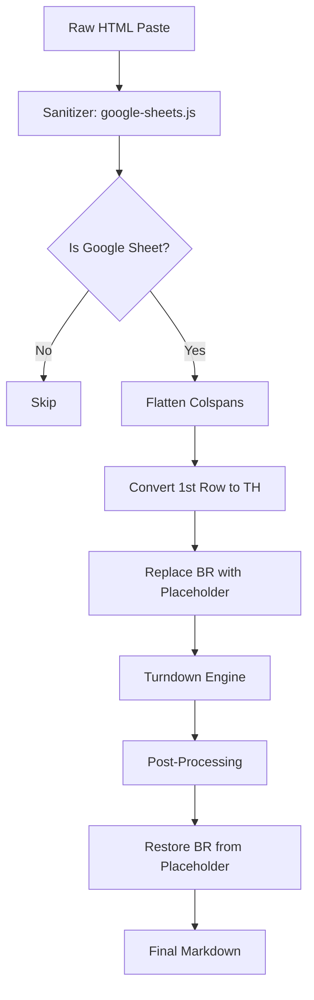
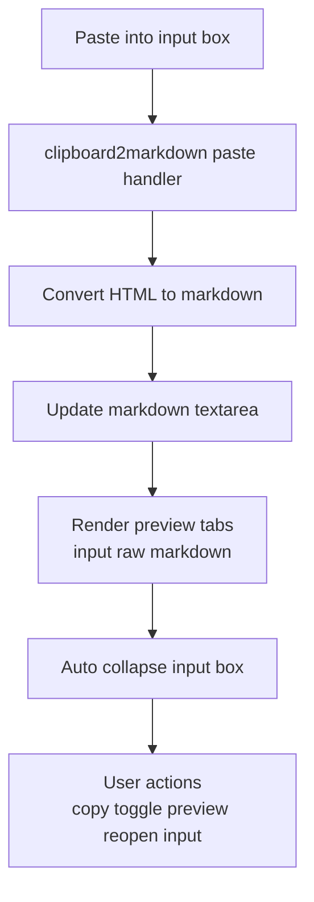

# GSD-Lite Work Log

---

## 1. Current Understanding (Read First)

<current_mode>
discuss
</current_mode>

<active_task>
None — ready for next task
</active_task>

<parked_tasks>
TASK-003: Add debug mode toggle with XML bundle export
TASK-004: Create LLM sanitization prompt for test fixtures
</parked_tasks>

<vision>
A client-side webapp that converts copied web content (HTML) into clean Markdown. It is powered by a Vite build system for reliable development and deployment. The conversion logic is modular, allowing for platform-specific rules (Jira, Confluence, etc.) and is covered by an automated regression test suite.
</vision>

<decisions>
DECISION-001: Migrate to Turndown.js — maintained successor to to-markdown.js, GFM table support, same author
DECISION-002: Debug bundle format is XML-tagged — agent-native, human-readable, no escaping issues
DECISION-003: Agent-as-oracle for testing — CI can't run paste events, LLM evaluates conversion quality
DECISION-004: Vendor Turndown locally — reliability over CDN, works offline, consistent with project structure
DECISION-005: Port all existing rules — no trimming, maintain feature parity during migration
DECISION-006: Pre-process HTML before Turndown — sanitize platform quirks rather than fighting the library
DECISION-007: Use Vite for the build system — solves browser caching and provides a modern dev environment.
DECISION-008: Adopt a modular `platforms/` architecture — isolates platform-specific logic for maintainability.
DECISION-009: Jira comment thread annotations — visible italic headers `*[ID ↩ parentID] Author - Date*` + `=== Thread X ===` separators. Blockquotes rejected (break code blocks/tables inside them).
DECISION-010: `data-attr + \u200B sentinel` pattern — reliable way to inject raw markdown through Turndown without escaping. Set `data-foo="raw text"` + `textContent='\u200B'` on element; custom rule reads attribute, ignores content.
DECISION-011: UX trust mode uses three preview tabs — rendered input HTML, raw HTML source, and rendered markdown preview — while keeping markdown textarea as canonical copy output.
DECISION-012: App opens directly in main conversion view with visible paste target; input box auto-collapses after paste and can be manually reopened.
</decisions>

<blockers>
None
</blockers>

<next_action>
Update `gsd-lite/ARCHITECTURE.md` to document preview tabs, input-collapse behavior, and mobile-first visible paste target.
</next_action>

---

## 2. Key Events Index (Project Foundation)

### Architecture Decisions
- LOG-001: Turndown Migration — Replaced to-markdown.js with Turndown.js + GFM plugin
- LOG-002: Project Reorganization — lib/, assets/, script/ folders for cleaner structure

---

## 3. Atomic Session Log (Chronological)

### [LOG-001] - [PLAN] - Turndown migration plan created - Task: TASK-002
**Timestamp:** 2026-02-10
**Details:**
- Analyzed current `clipboard2markdown.js` — found 10 custom rules in `pandoc` array
- Confirmed Turndown API compatibility: `filter` + `replacement` signature identical
- GFM plugin provides tables, strikethrough, task lists out of box
- Decision: Vendor locally (not CDN) for reliability + offline support
- Decision: Port all rules, no trimming

### [LOG-002] - [EXEC] - Project reorganization - Task: TASK-002
**Timestamp:** 2026-02-10
**Details:**
- Created `lib/` — vendored `turndown.js` + `turndown-plugin-gfm.js`
- Created `assets/` — moved `bootstrap.css`, `background.svg`, `background-dark.svg`
- Created `script/` — moved `download_turndown.py`
- `to-markdown.js` left in root (pending deletion after migration verified)

### [LOG-003] - [EXEC] - Turndown migration complete - Task: TASK-002
**Timestamp:** 2026-02-10
**Details:**
- Updated `index.html`:
  - Script refs: `lib/turndown.js`, `lib/turndown-plugin-gfm.js`
  - Asset refs: `assets/bootstrap.css`, `assets/background*.svg`
  - Attribution text updated to link Turndown
- Rewrote `clipboard2markdown.js`:
  - TurndownService with options: `headingStyle: 'atx'`, `codeBlockStyle: 'fenced'`, etc.
  - `.use(turndownPluginGfm.gfm)` for tables/strikethrough/tasklists
  - Ported all 10 custom rules via `addRule()`
  - `escape()` post-processor preserved (smart punctuation cleanup)
- Initial test: basic cases work ✓
- Blocker found: Jira tables still broken

### [LOG-004] - [FIX] - Jira table conversion fixed via HTML pre-processing - Task: TASK-005
**Timestamp:** 2026-02-10
**Details:**
- **Root cause:** Jira wraps table cell content in `<p data-renderer-start-pos="...">` tags
- Turndown GFM plugin expects simple `<td>text</td>`, not nested `<p>` elements
- **Fix approach:** Pre-process HTML before Turndown (sanitize, don't fight the library)
- Added `sanitizeHTML()` function to `clipboard2markdown.js`:
  - Strips `<p>` tags inside `<td>`/`<th>`, preserving content
  - Removes empty `<span>` elements that interfere with parsing
- Updated `convert()` to call `sanitizeHTML(str)` before `turndown()`
- **Result:** Tables now convert correctly to markdown pipe format ✓
- **Remaining issue:** SQL code blocks lose line breaks (all on one line)
  - Jira's code block HTML structure needs investigation
  - Likely similar pre-processing fix needed

### [LOG-005] - [FEAT] - Google Sheets support implemented - Task: TASK-006
**Timestamp:** 2026-02-10
**Summary:** Implemented `google-sheets.js` platform module with sanitizer logic to handle merged cells (`colspan`) and line breaks (`<br>`) in tables, enabling clean Markdown table generation from Google Sheets copy-paste.

**Context & Problem:**
Copying from Google Sheets produces complex HTML that breaks standard Markdown converters:
1.  **Merged Cells:** Sheets uses `colspan="N"` to span columns visually. Turndown GFM plugin expects 1:1 `<td>` per column mapping and outputs raw HTML when it encounters spans.
2.  **Missing Headers:** Sheets uses `<td>` for the first row, but GFM requires `<th>` to recognize a table header.
3.  **Line Breaks:** Cells with multiple lines use `<br>`, but Markdown tables must be single-line per row.

**Solution Architecture:**
We implemented a dedicated sanitizer in `src/platforms/google-sheets.js` that runs *before* Turndown (following the pattern established in [LOG-004] for Jira).



**Key Implementation Details:**

1.  **Colspan Flattening (The "Visual Match" Strategy):**
    We flatten merged cells to match the visual grid. A cell spanning 2 columns becomes 1 cell, and its "ghost" neighbor (an empty placeholder `<td>`) is removed.
    *   **Logic:** Iterate `tr`, find `colspan="N"`, remove attribute. Then remove the next N-1 empty `<td>` elements.
    *   **Result:** A 4-column visual table becomes a 4-column HTML table structure that GFM understands.

2.  **Header Row Promotion:**
    Explicitly convert the first `<tr>`'s children from `<td>` to `<th>`.
    *   **Reasoning:** Turndown's GFM table rule strict check: `if (node.nodeName === 'TABLE' && hasThead(node))` — without `<th>`, it treats it as a layout table, not data.

3.  **Line Break Preservation (The Placeholder Pattern):**
    *   **Problem:** `<br>` inside a table cell breaks the single-line rule of Markdown tables.
    *   **Fix:** Sanitize `<br>` → `{{TABLE_BR}}` string literal.
    *   **Post-Process:** `src/converter.js` regex replaces `{{TABLE_BR}}` → `<br>` *after* Markdown generation.
    *   **Code:**
        ```javascript
        // src/platforms/google-sheets.js
        table.querySelectorAll('td br, th br').forEach(function (br) {
          br.replaceWith('{{TABLE_BR}}');
        });
        ```
    *   **Reference:** Same pattern used in Confluence logic (see `src/platforms/confluence.js`).

**Dependencies:**
-   **Upstream:** [LOG-004] (Sanitizer pattern established)
-   **Modules:** `src/platforms/google-sheets.js`, `src/platforms/index.js` (registration)

**Verification:**
-   Input: `tests/fixtures/google-sheets/simple_table.html` (4x4 table with colspans)
-   Output: Clean Markdown pipe table with `<br>` preserved in cells.
-   Status: **Verified & Merged**.

---
**Timestamp:** 2026-01-22 14:10
**Details:**
- SUBTASK-001: Base card component with props interface
- SUBTASK-002: Engagement metrics display (likes, comments, shares)
- SUBTASK-003: Layout grid with responsive breakpoints
- Risk: Responsive behavior may need user verification on mobile

### [LOG-005] - [SETUP] - Vite build system implemented - Task: N/A
**Timestamp:** 2026-02-10
**Details:**
- **Problem:** Browser caching was preventing JavaScript changes from loading, making debugging difficult.
- **Solution:** Introduced a `vite` build step to enable a modern development workflow.
- **Actions Taken:**
  - `npm init` and installed `vite`, `turndown`, and `turndown-plugin-gfm`.
  - Created `vite.config.js` with `base` path for GitHub Pages deployment.
  - Updated `package.json` with `dev`, `build`, and `preview` scripts.
  - Refactored `clipboard2markdown.js` and `index.html` to use ES Module imports instead of global scripts.
- **Outcome:** Caching issues are resolved. `npm run dev` provides a hot-reloading server for rapid testing. `npm run build` creates a production-ready `dist/` directory.

### [LOG-006] - [FIX] - Jira code block newlines and indentation preserved - Task: TASK-006
**Timestamp:** 2026-02-10
**Details:**
- **Root Cause:** A combination of HTML parser whitespace collapsing and Turndown's text extraction logic was dropping newlines and leading spaces.
- **Solution:** Implemented a robust, two-part pre-processing (sanitizer) and processing (rule) pipeline.
  - **Sanitizer (`sanitizeHTML`):**
    1. Iterates through Jira's line-based `<span>` elements.
    2. Replaces leading spaces with non-breaking space entities (`&nbsp;`) to prevent the HTML parser from collapsing them.
    3. Joins the processed lines with `<br>` tags to ensure the line breaks survive the DOM parsing step.
    4. Injects this new HTML back into the `<code>` element's `innerHTML`.
  - **Turndown Rule (`confluenceCodeBlock`):**
    1. Clones the `<code>` node to avoid altering the DOM.
    2. Replaces all `<br>` elements with `\n` characters.
    3. Replaces all `&nbsp;` characters (`\u00A0`) back to regular spaces.
    4. Extracts the cleaned `textContent` for the final markdown output.
- **Status:** The fix is verified and working correctly. **TASK-006 is complete.**

### [LOG-007] - [PLAN] - Refactor and implement automated testing - Task: TASK-007, TASK-008
**Timestamp:** 2026-02-10
**Details:**
- **Goal:** Improve maintainability and prevent regressions.
- **New Tasks Created:**
  - **TASK-007:** Refactor platform-specific logic into a modular `src/platforms/` directory.
  - **TASK-008:** Implement an automated test runner to verify fixtures.
- **Refactor Plan (TASK-007):**
  1. Move all generic rules (sup, sub, etc.) and sanitizers from `clipboard2markdown.js` to `src/platforms/common.js`.
  2. Update `src/platforms/index.js` to import and export all platform modules.
  3. Refactor `clipboard2markdown.js` into a slim orchestrator that imports `addAllRules` and `sanitize` from `src/platforms/index.js` and focuses only on DOM event handling.
- **Automated Test Plan (TASK-008):**
  1. Install `vitest` and `jsdom` as dev dependencies.
  2. Create a test file (e.g., `tests/conversion.test.js`).
  3. The test script will read all `.html` and `.md` file pairs from `tests/fixtures/`.
  4. For each pair, it will run the `convert` function on the HTML and assert that the output exactly matches the expected markdown.
  5. Update `package.json` to run tests via `npm test`.
- **Decision:** This modular structure makes it easy to add new platforms (Confluence, Notion) and test cases in the future.

### [LOG-008] - [EXEC] - Modular Refactor and Test Setup - Task: TASK-007, TASK-008
**Timestamp:** 2026-02-10
**Details:**
- **Refactor (TASK-007):**
  - Created `src/platforms/common.js` for generic rules.
  - Created `src/platforms/slack.js` for Slack-specific rules.
  - Updated `src/platforms/index.js` to aggregate all platforms.
  - Extracted core conversion logic to `src/converter.js` (imports `TurndownService` and platform rules).
  - Simplified `clipboard2markdown.js` to be a pure UI controller importing `convert()` from `src/converter.js`.
- **Test Infrastructure (TASK-008):**
  - Updated `vite.config.js` to include `test` configuration (jsdom environment).
  - Updated `package.json` to add `vitest` script.
  - Created `tests/conversion.test.js` which recursively finds fixtures and verifies conversion.
- **Next Steps:** User needs to run `npm install -D vitest jsdom` and `npm test` to verify.

### [LOG-009] - [FIX] - Test Failure Resolution - Task: TASK-008
**Timestamp:** 2026-02-10
**Details:**
- **Issue:** Test failed because Jira HTML contained `<button>Open image...</button>` text which polluted the Markdown output.
- **Fix:** Added a generic `removeButtons` rule to `src/platforms/common.js` to strip all button elements.
- **Status:** Tests passed after fix.
- **Pivot:** Switching to discuss mode to explain testing workflow to user.

### [LOG-010] - [INFO] - Testing Strategy Documented - Task: TASK-008
**Timestamp:** 2026-02-10
**Details:**
- **Action:** Updated `ARCHITECTURE.md` to reflect the new modular structure and the testing strategy.
- **Key Discovery:** The fixture-based testing model allows adding test cases without writing code (just files).
- **Documented Workflow:**
  1. Capture HTML from `pastebin`.
  2. Save as `.html` fixture.
  3. Create matching `.md` expectation.
  4. Run `npm test`.

### [LOG-011] - [FIX] - Disabled underscore escaping in Turndown - Task: TASK-008
**Timestamp:** 2026-02-10
**Details:**
- **Issue:** Turndown escapes ALL underscores by default (e.g., `join_payment_provider` → `join\_payment\_provider`). This is overly aggressive — underscores mid-word don't trigger emphasis in CommonMark.
- **Root Cause:** Turndown's default `escapes` array includes `[/_/g, '\\_']`.
- **Fix:** Overrode `turndownService.escape` in `src/converter.js` to unescape underscores after default escaping:
  ```javascript
  var originalEscape = turndownService.escape.bind(turndownService);
  turndownService.escape = function (string) {
    return originalEscape(string).replace(/\\_/g, '_');
  };
  ```
- **Fixture Updated:** `tests/fixtures/jira/jira_comments_with_table.md` corrected to expect unescaped underscores.
- **Reference:** https://github.com/mixmark-io/turndown/issues/233

### [LOG-012] - [FEATURE] - Added "Copy Raw HTML" button for fixture collection - Task: TASK-008
**Timestamp:** 2026-02-10
**Details:**
- **Problem:** Platforms like Slack don't expose clipboard HTML in dev tools, making fixture collection difficult.
- **Solution:** Added a "📋 Copy Raw HTML" button that appears after paste.
- **Implementation:**
  - `index.html`: Added button + status span in wrapper section.
  - `clipboard2markdown.js`: Store `lastPastedHtml` on paste, button copies it to clipboard via `navigator.clipboard.writeText()`.
- **Workflow:** Paste → Click button → Save HTML to `tests/fixtures/{platform}/{case}.html`.

### [LOG-013] - [SETUP] - CI/CD pipeline implemented - Task: N/A
**Timestamp:** 2026-02-10
**Details:**
- **Goal:** Automate testing on PRs, gate deployments behind passing tests.
- **Architecture:** Two separate workflows for clean separation of concerns.
- **Files Created/Modified:**
  - `.github/workflows/ci.yml` (NEW): Runs `npm run test` on pull requests to `master`.
  - `.github/workflows/static.yml` (MODIFIED): Added `test` job before `deploy`; deploy now `needs: test`.
- **Behavior:**
  - PRs to master → CI runs tests → blocks merge if fail
  - Push to master → Tests run → Deploy only if tests pass
  - Direct pushes to master still gated by test job in `static.yml`
- **Node version:** 20 (LTS), with npm caching enabled for faster runs.

### [LOG-014] - [FIX] - Slack conversion bugs fixed - Task: N/A
**Timestamp:** 2026-02-10
**Details:**
- **Problem:** Slack test fixture failing — two converter bugs identified:
  1. Ordered list items rendered on single line (`1. ...2. ...3. ...`)
  2. Code blocks not fenced — Slack uses `<pre><div>` not `<pre><code>`
- **Root Causes:**
  - `fencedCodeBlock` rule required `PRE > CODE` structure; Slack's `<pre><div>` didn't match
  - `listItem` rule missing trailing newline between items
- **Fixes in `src/platforms/common.js`:**
  1. `fencedCodeBlock`: Changed filter to match any `<pre>` element (removed `<code>` child requirement)
  2. `listItem`: Added trailing `\n` to replacement output
- **Result:** `npm test` passes, Slack fixtures now convert correctly

### [LOG-015] - [FEATURE] - Confluence table and list support - Task: TASK-009
**Timestamp:** 2026-02-10
**Details:**
- **Feature:** Added full support for complex Confluence content including nested tables, expand containers, and smart links.
- **Challenges Solved:**
  1. **Smart Links:** Confluence renders links as `<span data-inline-card>` with no `<a>` tag. Added sanitizer to convert them to proper anchors.
  2. **Emoji Images:** Converted `` to unicode characters.
  3. **Table Headers:** Cleaned up complex nested `<div>` and sorting icons in `<th>` cells.
  4. **Lists in Tables:** Markdown tables don't support lists. Implemented flattening logic to convert `<ul>/<li>` inside cells to inline text with `<br>` and `•` bullets.
  5. **Mixed Content:** Handled cells containing both paragraphs and lists by inserting correct `<br>` separators.
  6. **Empty Cells:** Added non-breaking spaces to empty cells to maintain table structure.
- **Testing:** Added robust fixtures (`bullet.html`, `nested_table.html`, `table.html`) covering edge cases.
- **Bug Fix:** Fixed issue where pasting new content appended to old content instead of replacing it.

### [LOG-016] - [REFINE] - Test Fixture Alignment - Task: TASK-009
**Timestamp:** 2026-02-10
**Details:**
- **Context:** Updated test fixtures to match improved converter output.
- **Decision:** Accepted that `<p>Text</p><ul><li>List</li></ul>` should render as `Text<br>- List` in table cells (with explicit break) rather than running together.
- **Action:** Updated `table.md` fixture to include `<br>` between text and lists, aligning the test expectation with the semantically correct converter output.
- **Result:** All tests passing.

### [LOG-017] - [FIX] - Google Sheets complex table support - Task: TASK-007
**Timestamp:** 2026-02-11
**Summary:** Implemented robust handling for complex Google Sheets tables including merged cells (rowspan/colspan), missing ghost cells, and pipe characters in links.

**The Challenge:**
Google Sheets HTML is notoriously difficult:
1.  **Rowspan Ghosts:** A cell with `rowspan="N"` causes the next N-1 rows to physically miss that `<td>`. This breaks Markdown table generators which expect a rectangular grid.
2.  **Colspan Logic:** A cell with `colspan="N"` is visually 1 column but physically covers N columns in the grid logic.
3.  **Broken Links:** Links containing `|` characters (e.g. "Operations | Google Cloud") break Markdown tables by acting as column separators.
4.  **Nested Breaks:** `<br>` tags inside links (`<a href>text<br></a>`) were causing breaks inside the link text.

**The Solution (Pattern: Grid Reconstruction):**
Instead of trying to patch the DOM in-place, we now:
1.  **Reconstruct the Visual Grid:** Build a 2D array representing the table, filling in "ghost" cells created by rowspans with placeholders.
2.  **Logical Column Counting:** Determine column count from the header row (logical cells) rather than the physical colgroup (which counts merged columns separately).
3.  **Sanitize Links:** 
    *   Move `<br>` out of `<a>` tags.
    *   Replace `|` in link text with `{{PIPE}}` placeholder (restored as `\|` post-processing).

**Key Algorithm:**
```javascript
// 1. Sanitize links (move <br>, placeholder pipes)
// 2. Build 2D grid from rows
// 3. For each cell:
//    - If blocked by rowspan from above -> inject placeholder
//    - If new cell -> use content, track its rowspan
// 4. Rebuild DOM from grid
```

**Outcome:**
*   Complex tables with mixed rowspans/colspans now render perfectly.
*   Links with pipes work correctly inside tables.
*   `tmp.html` case fully resolved.

### [LOG-018] - [FIX] - Unescaped dashes in table cells - Task: TASK-007
**Timestamp:** 2026-02-11
**Summary:** Fixed regression where dashes at the start of lines inside table cells were being escaped (e.g., `\- item`).

**Problem:**
Turndown's default escape function is aggressive: it escapes any `-` at the start of a line because it *could* be a list marker. However, inside a Markdown table cell, block-level lists are not supported, so a literal `-` is valid and preferred for bullet-like formatting. Users relying on manual indentation + dashes (e.g., `<br> - sub-item`) saw inconsistent behavior depending on spacing.

**Solution:**
Updated the `turndownService.escape` override in `src/converter.js` to unescape dashes:
```javascript
return originalEscape(string)
  .replace(/\\_/g, '_')
  .replace(/\\-/g, '-'); // New: unescape dashes
```

**Outcome:**
*   `\- Good ol'` -> `- Good ol'`
*   Preserves indentation for manual nested lists (e.g., `  - item`).
*   Verified with `tmp.html` case and existing regression tests.

### [LOG-019] - [FIX+FEAT] - Jira comment bugs fixed + thread annotation implemented - Task: N/A
**Timestamp:** 2026-02-23
**Depends On:** LOG-004 (Jira table pre-processing pattern), LOG-011 (Turndown escape override pattern)

---

#### Bug Fixes (4 issues in Jira comment rendering)

**Bug 1 — OL `start` attribute ignored** (`src/platforms/common.js`)
Jira renders each numbered section as a separate `<ol start="N">` with a single `<li>`. The `listItem` rule used `Array.indexOf` which always returned `1`. Fixed by reading `parent.getAttribute('start')` and computing `start + index - 1`.

**Bug 2 — Table with `<colgroup>` not converted** (`src/platforms/jira.js` sanitizer)
`turndown-plugin-gfm`'s `isFirstTbody()` checks `previousSibling` — a `<colgroup>` before `<tbody>` caused it to return `false`, so the table fell back to raw HTML. Fixed by removing `table colgroup` elements in the sanitizer before Turndown runs.

**Bug 3 — `<sub>` rendered as `~17~`** (`src/platforms/common.js`)
The `subscript` rule wrapped content in `~text~`. In GFM, `~` is not standard subscript syntax. Changed to return plain content.

**Bug 4 — Reaction emoji `<ul>` producing empty `- ` bullets** (`src/platforms/jira.js` sanitizer)
Comment footers contain `<ul><li><br></li></ul>` reaction elements. Each `<li>` with only a `<br>` produced `- \n`. The `escape()` regex `\n-\n` → `\n` only collapsed some, leaving stray `-` lines. Fixed by removing `[data-testid$="-footer"]` elements in the sanitizer.

---

#### Feature — Jira Comment Thread Annotations

**Design decision (DECISION-009):**
Jira comment threads have no markdown equivalent. After discussing options (flat, blockquote indentation, custom annotations), chose visible italic annotations with `=== Thread X ===` separators. Blockquotes rejected because they break code blocks and tables inside them.

Format:
```
=== Thread 27064 ===

*[27064] Kiet Luu (Ken) - January 27, 2026 at 12:50 PM*

...content...

*[27939 ↩ 27064] Kiet Luu (Ken) - February 5, 2026 at 3:36 PM*
```

**Implementation — 3 rounds of debugging:**

*Round 1 — Escape pass corrupting annotations:*
Initial approach used `em.textContent = '[ID] Author'` which goes through Turndown's escape pass, producing `\[ID\]` and `\=== Thread ===`. Fixed by switching to `data-` attributes + custom Turndown rules (`jiraThreadSeparator`, `jiraCommentAnnotation`) that read from the attribute and return raw markdown strings, bypassing the escape pass entirely.

*Round 2 — Turndown blank-node pruning (DECISION-010):*
`<p data-jira-annotation="...">` with no children has empty `textContent`. Turndown's `isBlank()` (`/^\s*$/.test(node.textContent)`) fires in `forNode()` before custom rules are checked — annotations were silently dropped. Fixed by setting `textContent = '\u200B'` (zero-width space, not matched by `\s`) as a sentinel. The custom rule ignores `content` and reads from the attribute.

*Round 3 — Activity feed guard for non-regression:*
All annotation logic is guarded by `doc.querySelector('[data-testid="issue-activity-feed..."]')` — ensures ticket descriptions and other Jira components are untouched.

**Partial copy degradation:** Falls back from `comment-in-view-wrapper` nesting → `comment-base-item` span nesting → ID-only annotation if header is stripped.

---

📦 STATELESS HANDOFF
**Layer 1 — Local Context:**
→ Last action: LOG-019 — Jira comment bugs fixed + thread annotation feature shipped
→ Dependency chain: LOG-019 ← LOG-004 (Jira pre-processing) ← LOG-011 (escape override)
→ Next action: Add test fixture `tests/fixtures/jira/comment_thread.html` + `.md`

**Layer 2 — Global Context:**
→ Architecture: Pre-process in sanitizers → Turndown rules → `escape()` post-process
→ Patterns: DECISION-010 — `data-attr + \u200B` bypasses Turndown escape without corrupting output

**Fork paths:**
- Add fixture → create `tests/fixtures/jira/comment_thread.html` + `.md`
- New task → check WORK.md parked tasks

---
### [LOG-020] - [EXEC] - 3-view preview UX + mobile-first input flow shipped - Task: TASK-010
**Timestamp:** 2026-02-23 17:10
**Depends On:** LOG-012 (Copy Raw HTML control pattern), LOG-019 (recent Jira UX/code context)

---

#### Executive Summary
Implemented the full credibility-oriented UX iteration requested in discussion:
1) 3-tab preview mode for side-by-side trust building,
2) copy convenience for converted markdown,
3) mobile-safe landing behavior (main view available immediately), and
4) input-box collapse control to reduce dual-textbox confusion after paste.

#### What Changed
- Added preview workflow controls and labels with emojis for fast recognition (`index.html:256`, `index.html:257`, `index.html:258`).
- Added preview tabs with explicit modes: input render, raw HTML, markdown preview (`index.html:266`, `index.html:268`, `index.html:269`).
- Added visible, mobile-friendly paste target with placeholder guidance (`index.html:253`, `index.html:51`).
- Added input collapse state machine and toggle handler in UI controller (`clipboard2markdown.js:284`, `clipboard2markdown.js:399`).
- Added auto-collapse after successful paste and reopen-on-keyboard-paste behavior (`clipboard2markdown.js:351`, `clipboard2markdown.js:361`, `clipboard2markdown.js:345`).
- Added preview toggle label state (`clipboard2markdown.js:325`).

#### What We Got Wrong And Pivoted
Initial direct-main-view change solved mobile lockout but introduced a UX regression: users saw both the paste target and markdown output at once, which looked like duplicate primary inputs. We pivoted from "always-visible input" to "collapsible input with auto-collapse after paste + manual reopen" to preserve repaste speed without persistent clutter.

#### Raw Evidence
```html
<button class="action-btn" id="toggle-input-btn">📥 Hide Input Box</button>
<button class="action-btn" id="copy-html-btn">📋 Copy Raw HTML</button>
<button class="action-btn" id="copy-md-btn">📝 Copy Converted Markdown</button>
<button class="action-btn" id="toggle-preview-btn">👀 Show Preview</button>
```
Source: `index.html:256`, `index.html:257`, `index.html:258`, `index.html:259`

```javascript
var setInputCollapsed = function (collapsed, options) {
  inputCollapsed = collapsed;
  pastebin.classList.toggle('hidden', collapsed);
  toggleInputBtn.textContent = collapsed ? '📥 Show Input Box' : '📥 Hide Input Box';
};

pastebin.addEventListener('paste', function () {
  // ... convert
  setInputCollapsed(true, { skipFocus: true });
});
```
Source: `clipboard2markdown.js:284`, `clipboard2markdown.js:351`, `clipboard2markdown.js:361`

#### Decision Record
**Chosen path:** Tabbed preview + collapsible input.
- Reason: keeps trust/traceability high while minimizing visual overload on small screens.

**Rejected path A:** Keep input box permanently visible.
- Why not: creates dual-primary-input ambiguity after paste.

**Rejected path B:** Remove input box entirely after paste.
- Why not: hurts iterative paste workflow and discoverability for next conversion.

**Rejected path C:** 3 fixed columns instead of tabs.
- Why not: cramped on laptop/mobile and harder to scan.

#### State Flow


#### Dependency Chain
- LOG-020 depends on LOG-012 for action-button UX extension pattern (raw HTML copy flow).
- LOG-020 depends on LOG-019 as the latest controller context before UX layering.

---

📦 STATELESS HANDOFF
**Layer 1 — Local Context:**
→ Last action: LOG-020 (3-view preview UX + mobile-first/collapsible input shipped)
→ Dependency chain: LOG-020 ← LOG-012 ← LOG-019
→ Next action: Decide whether to document this UX in ARCHITECTURE only, or also add PROJECT-level success criterion for trust-preview UX.

**Layer 2 — Global Context:**
→ Architecture: UI orchestration lives in `clipboard2markdown.js`; conversion engine remains `src/converter.js`
→ Patterns: Additive UX features without changing sanitizer/rule conversion pipeline

**Fork paths:**
- Continue execution → Update `gsd-lite/ARCHITECTURE.md` with new UI flow and controls
- Discuss scope → Decide if `gsd-lite/PROJECT.md` should promote preview trust UX from implementation detail to explicit product criterion