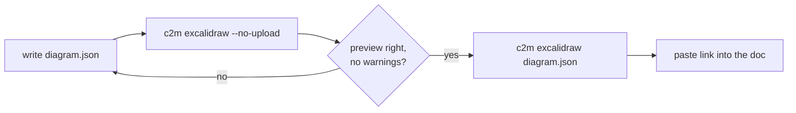
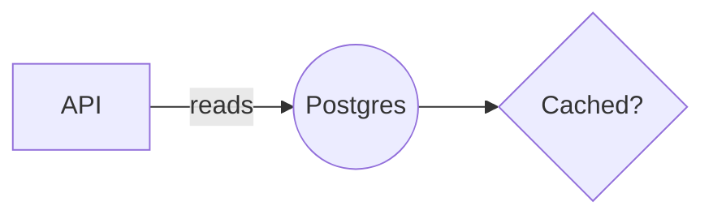

# v0.2.0: agents can draw Excalidraw diagrams

## TL;DR

`c2m excalidraw diagram.json` turns a short JSON description of boxes, labels and arrows into an `https://excalidraw.com/#json=...` share link, and prints a Mermaid preview plus layout warnings so the agent can check its drawing in a few lines of text before it ships the link. This release also brings the Excalidraw ⇄ Mermaid round trip (`c2m-diagrams`) to npm for the first time.

## Why

An agent writing a document had no way to hand you a hand-drawn Excalidraw diagram. The Excalidraw MCP draws inline, but only a human clicking its widget gets a share link, and a terminal session has no widget. The fallback was Mermaid blocks, which do not screenshot into Google Docs the way Excalidraw does. Checking a drawing was also expensive: rendering an image costs a lot of tokens, and raw Excalidraw JSON is too verbose to reason about.

## Highlights

| What | Detail |
|---|---|
| `c2m excalidraw <file\|->` | JSON array of `rectangle`, `ellipse`, `diamond`, `text`, `arrow`, `line` → encrypted share link on stdout line 1 |
| Mermaid preview | shapes keep their kind (`[box]`, `((round))`, `{diamond}`), arrows become edges with labels, free text becomes `%% note:` lines; node ids are your element ids |
| Layout warnings | partial overlaps (full containment is fine, for group boxes), labels that do not fit, unattached or dangling arrow ends, duplicate ids, dropped MCP commands |
| `--no-upload` | check-only runs while iterating, so every attempt does not mint a link |
| Short input | `label` becomes centred bound text, arrows bind both ways, bound arrows are routed between shape edges, text is sized for you |
| MCP-compatible | `startBinding: {elementId}` works like `start: {id}`; `cameraUpdate`, `delete`, `restoreCheckpoint` are dropped with a warning |
| Self-documenting | `c2m excalidraw --help` is the whole manual: format, worked example, sizing rules, the loop |
| `c2m-diagrams` | now published: `expand`, `strip`, `show`, `edit` for existing share links |

## The loop



## Before / After

Before: the document got a Mermaid block, or no diagram.

After:

```text
$ c2m excalidraw diagram.json
https://excalidraw.com/#json=fQ3XD_GzkpOtGQPcrf3bW,7n291mkJfDz_cLUwyNZe1g
```

````text

````

The link opens an editable, hand-drawn diagram on excalidraw.com. The scene is AES-GCM encrypted and the key lives only in the `#` fragment, so the storage server cannot read it.

## Upgrade notes

- No new dependencies. Upload uses Node's built-in WebCrypto and `fetch` with the existing `pako`.
- `c2m` with no subcommand is unchanged: clipboard conversion, macOS only. `c2m excalidraw` and `c2m-diagrams` run on any OS with Node 20+.
- `mermaid` moved to `devDependencies`; only the web app bundles it, so installs are lighter.

## Files changed

- `src/diagrams/skeleton.js`: new, the pure JSON-to-scene normalizer, lint and preview
- `bin/excalidraw.js`: new, the subcommand, its help text and the upload error messages
- `bin/cli.js`: dispatches `excalidraw` before any clipboard code
- `tests/diagrams/skeleton.test.js`: six small inline tests at the pure seam
- `README.md`, `AGENTS.md`, `docs/`: where uploading now lives
