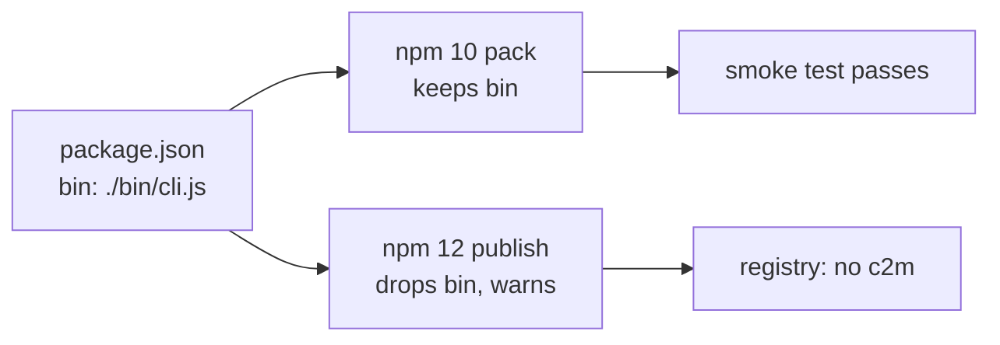

# v0.2.1: the `c2m` command is back in the package

## TL;DR

v0.2.0 reached npm without its commands. Installing it gave you the code but no `c2m` or `c2m-diagrams` on your `PATH`. v0.2.1 is the same code with the commands restored. Use v0.2.1; v0.2.0 is deprecated.

## Why

The publish step runs the newest npm (12). npm 12 treats a `bin` path written as `./bin/cli.js` as invalid, removes it from the published `package.json`, and only prints a warning. The CI smoke test packed with the runner's own npm (10), which accepts that form, so the install-and-run check passed while the real tarball had no commands.

## Highlights

| What | Detail |
|---|---|
| `bin` paths | `./bin/cli.js` → `bin/cli.js` (same for `c2m-diagrams`), the form npm 12 keeps |
| Smoke test | packs with the same `npm@latest` as the publish step, and fails if npm reports that it auto-corrected `package.json` |
| Smoke coverage | also runs `c2m excalidraw --help` and `c2m-diagrams --help` from the installed package |

## Upgrade notes

`npm install -g @luutuankiet/clipboard2markdown@latest`, or `npx -p @luutuankiet/clipboard2markdown c2m excalidraw --help`. Nothing else changed; see v0.2.0 for the `c2m excalidraw` feature.

## Files changed

- `package.json`: `bin` paths without the `./` prefix
- `.github/workflows/publish.yml`: smoke test packs with the publishing npm and fails on auto-correction
