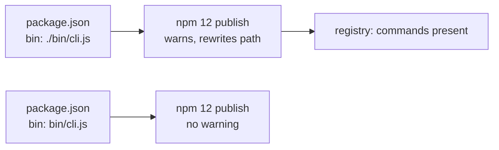

# v0.2.1: bin paths npm 12 accepts as written

## TL;DR

No behaviour change. v0.2.0 works, including its `c2m` and `c2m-diagrams` commands. This release spells the `bin` paths the way npm 12 wants them, so publishing no longer prints a warning, and makes the CI smoke test fail on that kind of warning in future.

## Why

The publish step runs the newest npm (12). When it saw `bin` paths written as `./bin/cli.js`, it printed `"bin[c2m]" script name bin/cli.js was invalid and removed`, then published the paths rewritten as `bin/cli.js`. Installing v0.2.0 from the registry gives working commands, which was verified after release. The warning still deserved fixing, because it read like a broken package and the smoke test could not see it: the test packed with the runner's npm 10, not the npm that publishes.

## Highlights

| What | Detail |
|---|---|
| `bin` paths | `./bin/cli.js` → `bin/cli.js` (same for `c2m-diagrams`), so npm 12 publishes them unchanged |
| Smoke test | packs with the same `npm@latest` as the publish step, and fails if npm reports it auto-corrected `package.json` |
| Smoke coverage | also runs `c2m excalidraw --help` and `c2m-diagrams --help` from the installed package |

## Upgrade notes

Optional. `npm install -g @luutuankiet/clipboard2markdown@latest` gets it; v0.2.0 users lose nothing by staying.

## Files changed

- `package.json`: `bin` paths without the `./` prefix
- `.github/workflows/publish.yml`: smoke test packs with the publishing npm and fails on auto-correction
