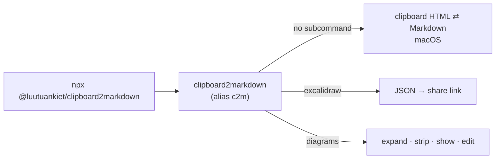

# v0.2.2: one command, and `npx` works without `-p`

## TL;DR

`npx -y @luutuankiet/clipboard2markdown excalidraw diagram.json` now works. Every feature goes through one command, `clipboard2markdown`, also installed as `c2m`; the diagram tools moved under it as `c2m diagrams`. Nothing was removed: `c2m-diagrams` still works.

## Why

Before this release, the short `npx` form failed with `npm error could not determine executable to run`. With no `-p`, npx runs the package's only command, or else the command named after the package (`clipboard2markdown`). The package had two commands, `c2m` and `c2m-diagrams`, and neither had that name, so npx gave up. The working form, `npx -p @luutuankiet/clipboard2markdown c2m ...`, is long and easy to get wrong, and the short form is the one people and agents try first.

## Highlights

| What | Detail |
|---|---|
| Main command | `clipboard2markdown`, so bare `npx @luutuankiet/clipboard2markdown <subcommand>` resolves |
| Short name | `c2m` is the same program |
| `c2m diagrams` | `expand`, `strip`, `show`, `edit`, previously only reachable as `c2m-diagrams` |
| Alias kept | `c2m-diagrams` behaves exactly as before |
| Guard | a unit test fails if no command is named after the package; CI runs bare `npx` on the packed tarball before publishing |



## Before / After

```text
before: npx -y @luutuankiet/clipboard2markdown excalidraw d.json
        npm error could not determine executable to run
after:  npx -y @luutuankiet/clipboard2markdown excalidraw d.json
        https://excalidraw.com/#json=...
```

## Upgrade notes

Nothing to change. Scripts calling `c2m-diagrams` keep working; new scripts can write `c2m diagrams`.

## Files changed

- `package.json`: a `clipboard2markdown` bin, pointing at the same `bin/cli.js` as `c2m`
- `bin/cli.js`: dispatches `diagrams`; help lists every subcommand and the `npx` form
- `bin/diagrams.js`: usage text says `c2m diagrams`
- `tests/cli.test.js`: main-bin name and `diagrams` routing
- `.github/workflows/publish.yml`: smoke test runs bare `npx` against the packed tarball
- `README.md`, `AGENTS.md`, `docs/architecture/diagrams.md`: one command, `npx` first
