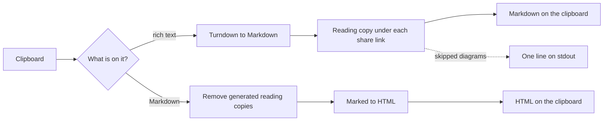
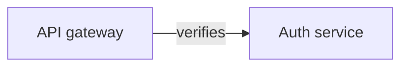

# v0.3.0: the clipboard command handles diagrams both ways

## TL;DR

`c2m` (no subcommand) now does the diagram step for you. Copy rich text that carries excalidraw.com share links, run `c2m`, and the Markdown already has a Mermaid reading copy under each link. Copy Markdown that carries those reading copies, run `c2m`, and the HTML you paste into Slack has only the link. `--no-diagrams` turns both off.

## Why

Diagrams were a separate, manual step. Rich text from Confluence or Google Docs needed a `c2m diagrams expand` before an agent could read its diagrams, and Markdown on its way to Slack needed the Mermaid removed by hand, or the recipient got a wall of it next to the link. People run `c2m` from a keyboard macro, and the second step kept getting forgotten.

A macro also needs to know when to speak up. The command used to write a success line on every run, so "there was output" could not mean "something went wrong". Now stdout is empty on a clean run.

## Highlights

| What | Detail |
|---|---|
| Rich text → Markdown | every share link (anchor, bare text, list item) gets a reading copy under it; a link appearing twice is expanded once; links in code fences are ignored |
| Markdown → HTML | generated reading copies are removed before conversion; Mermaid you wrote yourself is kept; no network |
| Marker-less copies | a reading copy that lost its `begin` / `end` comments on a trip through rich text is still recognised by its `%% generated from <url>` first line: replaced on the way to Markdown, removed on the way to HTML |
| Fast and bounded | all links download at once; each attempt times out after 3s; a timeout, dropped connection, `429` or `5xx` is retried twice; the whole step gives up after 6s |
| Quiet on success | stdout gets one line only when something needs attention, e.g. `c2m: 2 of 3 diagrams skipped (timeout, 404)` |
| Never loses the paste | a diagram that cannot be fetched leaves its link as written with no block; the clipboard is still written and the exit code is still `0` |
| `c2m diagrams expand` | same retry policy and parallel downloads; a failed link still gets its visible `%% could not load` block |
| Opt out | `--no-diagrams` behaves exactly like `0.2.2`, with no network request |



## Before / After

Copying a Confluence paragraph with one diagram link and running `c2m`:

Before (`0.2.2`):

```
See [the flow](https://excalidraw.com/#json=<id>,<key>)
```

After (`0.3.0`):

````
See [the flow](https://excalidraw.com/#json=<id>,<key>)

<!-- excalidraw-mermaid:begin <id> -->

<!-- excalidraw-mermaid:end <id> -->
````

Copying that Markdown back and running `c2m` gives HTML with just the link.

## Upgrade notes

- **New network behaviour.** Rich text → Markdown now sends one read-only `GET` per distinct share link to `json.excalidraw.com`. The key in the link's `#` fragment is never sent, and nothing from your clipboard is uploaded. Pass `--no-diagrams` to keep the old zero-network behaviour. The web page is unchanged.
- **stdout changed.** On a clean clipboard run stdout is now empty; the empty-clipboard and conversion-failed messages also go to stdout (they still go to stderr too). Exit codes are unchanged: `0` converted, `1` empty clipboard, `2` conversion failed. Skipped diagrams still exit `0`.
- **For a keyboard macro,** install globally and call it by absolute path; this skips npx's registry lookup (about 1.7s per run):

  ```bash
  npm i -g @luutuankiet/clipboard2markdown@latest
  echo "$(command -v node) $(npm root -g)/@luutuankiet/clipboard2markdown/bin/cli.js 2>/dev/null"
  ```

  Put the printed line in the macro, then notify when its output is not empty. A global install belongs to one Node version; reinstall after switching Node.

## Files changed

- `src/clipboard-convert.js`: new; what the clipboard command does to content, without the clipboard
- `src/diagrams/retry.js`: new; the retry policy, used by the CLI paths only
- `src/diagrams/markdown.js`: strip recognises marker-less reading copies; expand gains parallel downloads, a deadline, an omit-on-failure mode and per-link skip reasons
- `bin/cli.js`: `--no-diagrams`, stdout notice line, help text
- `bin/diagrams.js`: `expand` uses the retry policy
- `docs/adr/0003-clipboard-command-expands-diagrams.md`: why the clipboard command now reads from the network
