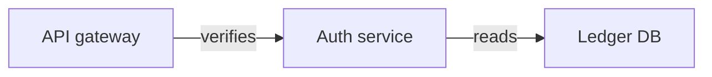
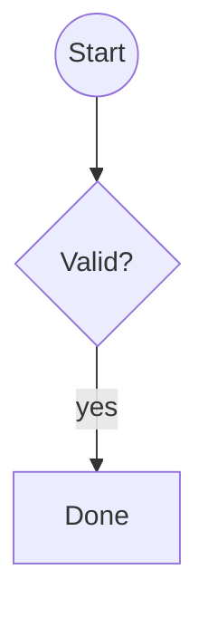

## Inventory

| diagram | link |
|---|---|
| gateway | [open](https://excalidraw.com/#json=bound01,C0J-T6YLyjITbqXy9z_Kow) |
| shapes | [open](https://excalidraw.com/#json=shapes05,C0J-T6YLyjITbqXy9z_Kow) |

<!-- excalidraw-mermaid:begin bound01 -->

<!-- excalidraw-mermaid:end bound01 -->

<!-- excalidraw-mermaid:begin shapes05 -->

<!-- excalidraw-mermaid:end shapes05 -->

The gateway again: [same canvas](https://excalidraw.com/#json=bound01,C0J-T6YLyjITbqXy9z_Kow).

- first item
- item with [a canvas](https://excalidraw.com/#json=groups03,C0J-T6YLyjITbqXy9z_Kow)
  continued line of the same item

  <!-- excalidraw-mermaid:begin groups03 -->
  ```mermaid
  %% generated from https://excalidraw.com/#json=groups03,C0J-T6YLyjITbqXy9z_Kow; reading copy, edits here do not change the canvas
  flowchart LR
    subgraph platform [Platform]
      subgraph ingest [Ingest]
        reader[Feed reader]
        parser[Parser]
      end
      store[Event store]
    end
    client[Client app]
    reader --> parser
    parser --> store
    client -->|pushes| platform
  ```
  <!-- excalidraw-mermaid:end groups03 -->
- last item
