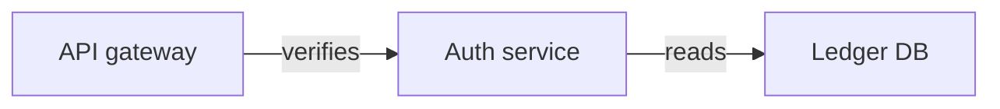

Google export escaped this one: [diagram](https://excalidraw.com/#json=bound01,C0J\-T6YLyjITbqXy9z\_Kow)

<!-- excalidraw-mermaid:begin bound01 -->

<!-- excalidraw-mermaid:end bound01 -->

Trailing paragraph.
