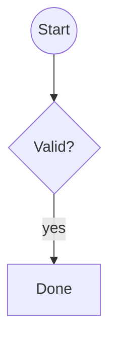

Missing scene: [gone](https://excalidraw.com/#json=missing99,C0J-T6YLyjITbqXy9z_Kow)

<!-- excalidraw-mermaid:begin missing99 -->
```mermaid
%% generated from https://excalidraw.com/#json=missing99,C0J-T6YLyjITbqXy9z_Kow; reading copy, edits here do not change the canvas
%% could not load: scene not found (HTTP 404)
```
<!-- excalidraw-mermaid:end missing99 -->

Wrong key: [locked](https://excalidraw.com/#json=bound01,AAAAAAAAAAAAAAAAAAAAAA)

<!-- excalidraw-mermaid:begin bound01 -->
```mermaid
%% generated from https://excalidraw.com/#json=bound01,AAAAAAAAAAAAAAAAAAAAAA; reading copy, edits here do not change the canvas
%% could not load: could not decrypt scene (wrong key or corrupt payload)
```
<!-- excalidraw-mermaid:end bound01 -->

Good one: [ok](https://excalidraw.com/#json=shapes05,C0J-T6YLyjITbqXy9z_Kow)

<!-- excalidraw-mermaid:begin shapes05 -->

<!-- excalidraw-mermaid:end shapes05 -->

```
Code fences are left alone: https://excalidraw.com/#json=bound01,C0J-T6YLyjITbqXy9z_Kow
```
