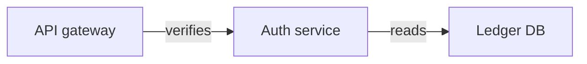
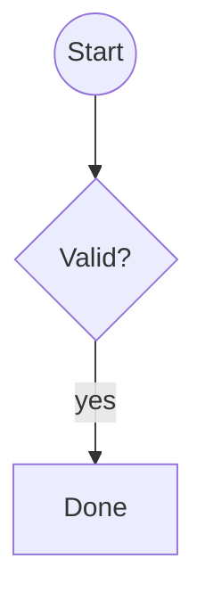
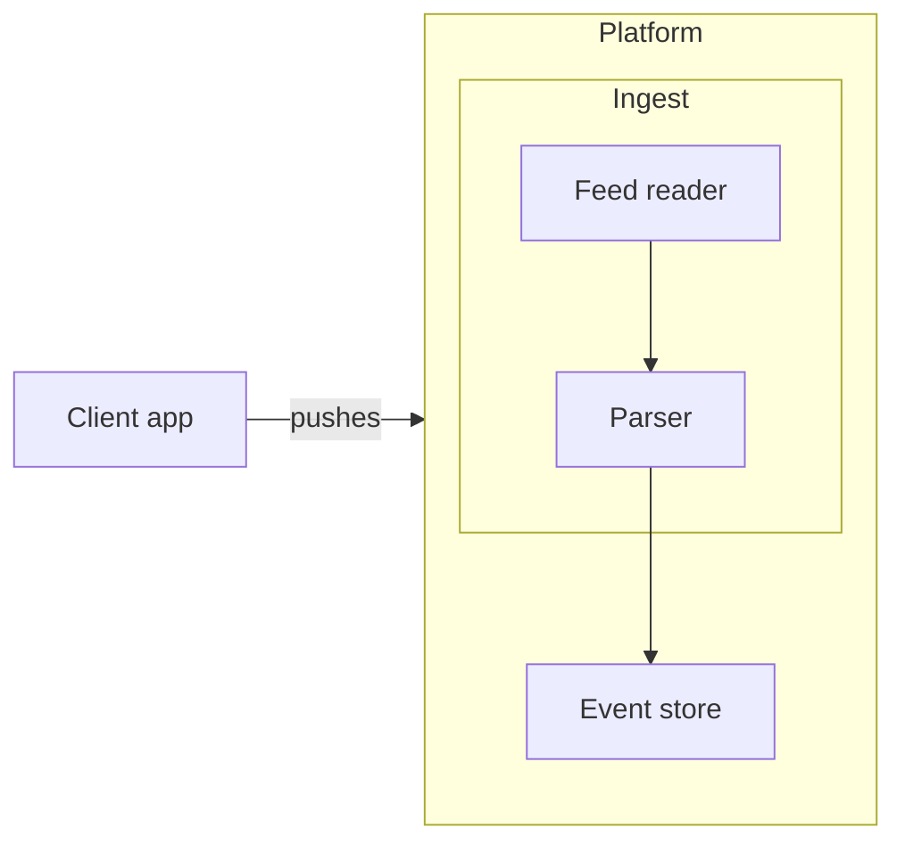

# Release notes

The request path is drawn in [the gateway diagram](https://excalidraw.com/#json=bound01,C0J-T6YLyjITbqXy9z_Kow) for review.

<!-- excalidraw-mermaid:begin bound01 -->

<!-- excalidraw-mermaid:end bound01 -->

Grouping is shown in the [platform canvas][platform].

Sequence sketch: <https://excalidraw.com/#json=seq08,C0J-T6YLyjITbqXy9z_Kow>

<!-- excalidraw-mermaid:begin seq08 -->
```mermaid
%% generated from https://excalidraw.com/#json=seq08,C0J-T6YLyjITbqXy9z_Kow; reading copy, edits here do not change the canvas
%% outline (needs agent): looks like a sequence diagram (lifelines)
%% labels:
%%   buyer: Buyer
%%   shop: Shop
%%   bank: Bank
%% unconnected arrow "order": ? --> ?
%% unconnected arrow "charge": ? --> ?
%% unconnected arrow "ok": ? -.-> ?
```
<!-- excalidraw-mermaid:end seq08 -->

Bare link to the shapes: https://excalidraw.com/#json=shapes05,C0J-T6YLyjITbqXy9z_Kow

<!-- excalidraw-mermaid:begin shapes05 -->

<!-- excalidraw-mermaid:end shapes05 -->

[platform]: https://excalidraw.com/#json=groups03,C0J-T6YLyjITbqXy9z_Kow

<!-- excalidraw-mermaid:begin groups03 -->

<!-- excalidraw-mermaid:end groups03 -->
