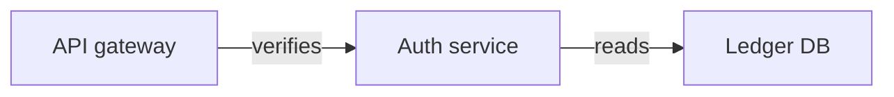
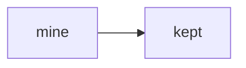
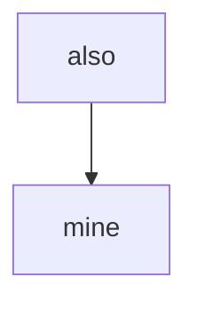

Copied back from a rich-text editor: [diagram](https://excalidraw.com/#json=bound01,C0J-T6YLyjITbqXy9z_Kow)

<!-- excalidraw-mermaid:begin bound01 -->

<!-- excalidraw-mermaid:end bound01 -->

Mine:



- in a list: [groups](https://excalidraw.com/#json=groups03,C0J-T6YLyjITbqXy9z_Kow)

  <!-- excalidraw-mermaid:begin groups03 -->
  ```mermaid
  %% generated from https://excalidraw.com/#json=groups03,C0J-T6YLyjITbqXy9z_Kow; reading copy, edits here do not change the canvas
  flowchart LR
    subgraph platform [Platform]
      subgraph ingest [Ingest]
        reader[Feed reader]
        parser[Parser]
      end
      store[Event store]
    end
    client[Client app]
    reader --> parser
    parser --> store
    client -->|pushes| platform
  ```
  <!-- excalidraw-mermaid:end groups03 -->


