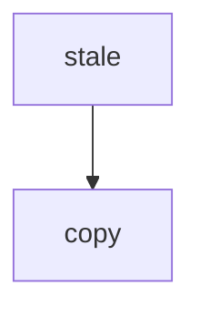
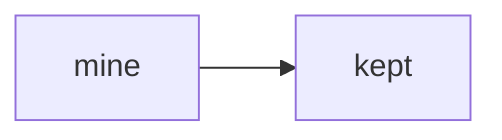
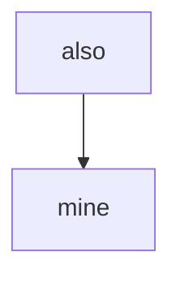

Copied back from a rich-text editor: [diagram](https://excalidraw.com/#json=bound01,C0J-T6YLyjITbqXy9z_Kow)



Mine:



- in a list: [groups](https://excalidraw.com/#json=groups03,C0J-T6YLyjITbqXy9z_Kow)

  ```
  %% generated from https://excalidraw.com/#json=groups03,C0J-T6YLyjITbqXy9z_Kow; reading copy, edits here do not change the canvas
  flowchart TB
    stale --> nested
  ```


